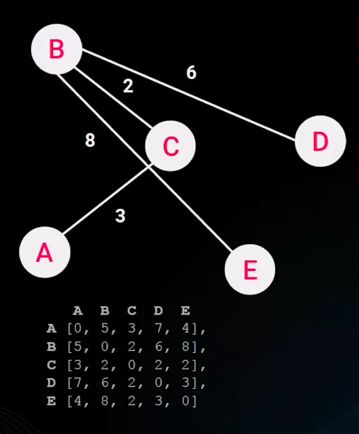

# INTRODUÇÃO À GENAI (INTELIGÊNCIA GERADA POR ALGORITMOS GENÉTICOS)

Na primeira videoaula, mergulharemos no fascinante mundo dos algoritmos genéticos, uma classe especial de algoritmos de otimização. Para compreender a essência desses algoritmos, começamos definindo o que é um algoritmo de otimização. Exploraremos a ideia de melhorar soluções, delimitando as restrições que moldam os problemas de otimização. Utilizaremos o desafiador "Problema do Caixeiro Viajante" (do inglês, “Traveling Salesman Problem”, o que dá origem à sigla comum TSP) como exemplo, desdobrando sua função objetivo, revelando a codificação de possíveis soluções e elucidando suas restrições.

Aprofundaremos a compreensão dos tipos de problemas de otimização, distinguindo entre minimização e maximização, lineares e não lineares, contínuos e discretos, destacando o TSP como um exemplo emblemático. Em seguida, exploraremos as variedades de soluções, diferenciando métodos exatos, como a análise analítica e força bruta, que garantem a resposta ótima. Demonstraremos, de maneira prática, a aplicação da força bruta para o “problema do caixeiro viajante”, evidenciando que, em certos problemas, encontrar a solução ótima pode requerer a avaliação de todas as possíveis soluções.

Introduziremos os métodos heurísticos como soluções eficientes para problemas de larga escala e complexos. Demonstramos a técnica do "vizinho mais próximo" (do inglês “nearest neighbour”) aplicada ao TSP, enfatizando a velocidade e viabilidade dessas soluções. Além do “vizinho mais próximo”, vamos ver na prática outros algoritmos heurísticos determinísticos funcionando para resolver o “problema do caixeiro viajante na prática”, como o Convex Hull. Vamos discutir sobre a importância desse tipo de algoritmo em encontrar soluções factíveis (subótimas) com baixo custo computacional. E, por fim, discutiremos sobre outras abordagens heurísticas e apresentaremos os algoritmos genéticos como um algoritmo heurístico bioinspirado.

## O que é um algoritmo de otimização

* Otimização refere-se ao processo de encontrar a melhor solução possível para um problema, sujeito a restrições específicas.
* Essa solução é geralmente a que maximiza ou minimiza uma função objetiva.

## O Problema do Caixeiro Viajante

* O Problema do Caixeiro Viajante (PCV) é um desafio clássico na teoria dos grafos e otimização combinatória.
* O objetivo é encontrar **o caminho mais curto** que visita todas as cidades exatamente uma vez e retorna à cidade de origem.
* Qual é o caminho que conecta as cidades A, B, C e D com a menor distância
* A-B-C-D-E?

## Função de custo

* É uma medida quantitativa que avalia o desempenho de uma solução em relação aos objetivos do problema.
* O objetivo é minimizar ou maximizar essa função para encontrar a melhor solução.
* A função de custo reflete o trade-off entre diferentes variáveis e fornece uma métrica para avaliar a eficácia das soluções propostas.
* É a função que usamos para saber o quão boa é uma solução.
* Geralmente o objetivo é minimizar ou maximizar essa função.
* No PCV a função de custo é a soma das distâncias do caminho executado.
* O objetivo é minimizar a função de custo.

* No PCV é a soma das distâncias.

* **f** é a função de custo.
* **T** é uma possível solução (ciclo hamiltoniano). Exemplo: **T = {(A,B), (B,C), (D,C) (D,E), (E,A)}**
* **w_ij** é a distância entre duas cidades.

## Restrições

* Uma restrição em um problema de otimização é uma condição que limita as soluções viáveis.
* Ela define as restrições ou limitações que devem ser consideradas ao procurar a melhor solução.
* Restrições ajudam a refinar o espaço de busca para encontrar soluções realistas e factíveis.

## Restrições do PCV

* Visitar cada cidade exatamente uma vez.
* Finalizar na mesma cidade que iniciou.
* Existir um caminho possível entre qualquer par de cidades.
* Mesma distância entre duas cidades independente da direção (PCV simétrico).

# TIPOS DE PROBLEMA DE OTIMIZAÇÃO

## Minimização/Maximização

* **Minimização:** o objetivo é encontrar a solução que minimize a função de custo ou erro. Exemplo: minimizar o custo total de produção em uma fábrica. 
* **Maximização:** o objetivo é encontrar a solução que maximize a função de benefício ou lucro. Exemplo: maximizar o lucro em uma empresa ao determinar a quantidade ao determinar a quantidade ideal de produção.

## Problemas lineares/não-lineares

* **Lineares:** a função de custo ou restrições seguem relações lineares. Exemplo: problema de programação linear para otimizar a distribuição de recursos.
* **Não-Lineares:** a função de custo ou restrições tem relações não lineares. Exemplo: otimização não linear em designe de produtos sujeitos a restrições não lineares.

## Problemas contínuos/discreto

* **Contínuos:** as variáveis podem assumir qualquer valor em um intervalo contínuo. Exemplo: otimização contínua de parâmetros em um processo de manufatura.
* **Discreto:** as variáveis só podem assumir valores discretos geralmente inteiros. Exemplo: otimização discreta na programação de horários, onde as horas de trabalho são números inteiros.

# TIPO DO PROBLEMA DO CAIXEIRO VIAJANTE

## Minimização

* O problema do caixeiro viajante geralmente é formulado com um problema de minimização, onde o objetivo é encontrar o caminho mais curto que visita cada cidade exatamente uma vez e retorna á cidade de origem.

## Não-Lineares

* O problema do caixeiro viajante é não linear, pois envolve uma função de custo (distância) que não segue relações lineares.
* Pode ser formulado com um problema linear para resolver problemas com poucas cidades.

## Discreto

* As variáveis associadas ao problema do caixeiro viajante são geralmente discretas, representando as cidades a serem visitadas em uma ordem específica.

# TIPOS DE SOLUÇÕES DE OTIMIZAÇÃO

## Exatas

**Vantagens**
* Encontrar a solução **ótima**.
* Garante encontrar a melhor solução em todas as possíveis soluções do problema
* Mais eficientes para problemas simples

**Desvantagens**
* Limitações em problemas complexos, não lineares, ou não diferenciáveis.
* Complexidade para modelar o problema de forma analítica, às vezes não sendo possível.
* Método força-bruta tem alto custo computacional.

## Heurísticas

**Vantagens**
* Eficiente em problemas complexos não lineares, não diferenciais ou de alta dimensionalidade.
* Fácil adaptabilidade em problemas complexos.
* Rápida convergências em uma resposta sub-ótima para alguns problemas comparado com método exato.

**Desvantagens**
* Encontrar uma solução sub-ótima ou apenas otimizada.
* Não garante otimização global.
* Métodos heurísticos dependem do ajuste dos parâmetros.

# SOLUÇÕES EXATAS

## Método analítico

**Como resolvemos:**
* Existe um método exato e analítico através da derivada da função.
* Nem todos os problemas podem ser resolvidos de maneira analítica por serem muito complexos, não lineares, ou não-diferenciáveis.

* Queremos encontrar o valor de **x** que minimize o valor de **y**.
* Qual o mínimo valor de **y**?
* Qual o valor de **x** que minimiza **y**?

## Força bruta

* Em qual sequência visitar as cidades para obter o menor caminho?

**Como resolvemos:**

* Por força bruta, podemos testar literalmente todas as combinações de cidades e encontrar a combinação que tem a menor distância.

* O número de combinações de caminho é **(n-1)!** para **n** cidades.
* Para 5 cidades temos:
    * (5-1)! = 4
    * 4x3x2x1 = 24 caminhos possíveis
* Para **10 cidades** temos 362.880 caminhos possíveis.
* Para **15 cidades** temos 87.178.291.200 caminhos possíveis.

* Força Bruta é capaz de resolver apenas instâncias muito pequenas do problema.
* Encontrar o melhor caminho em um número muito grande de cidades precisa de um método de busca.
* Esses métodos de busca são conhecidos como soluções heurísticas.

# SOLUÇÕES HEURÍSTICAS

* Abordagem de resolução de problemas que prioriza a rapidez e eficiência em vez da garantia da solução ótima.
* Baseia-se em regras práticas, intuições, e outras regras, como bio-inspiradas, permitindo decisões rápidas.
* Busca um equilíbrio entre precisão da solução e a eficiência do processo de tomada de decisão.

* Força Bruta é capaz de resolver apenas instâncias muito pequenas do problema.
* Encontrar o melhor caminho em um número muito grande de cidades precisa de um método de busca.
* Esses métodos de busca são conhecidos como soluções heurísticas.

**Vizinho mais próximo**
* Existe uma distância para cada cidade. 
* Como podemos escolher o caminho mais curto, partindo de **A**, usando uma lógica simples.
* Podemos fazer uma **otimização local**, escolhendo sempre o mais próximo.

## Demonstração

Existe o site [tspvis](https://tspvis.com/), este site permite testar diferentes algoritmos para otimização, como **algoritmos heurísticos**, **algoritmos heurísticos melhorados** e os **algoritmos heurísticos exaustivos (força bruta)**.

