# HISTÓRIA E EVOLUÇÃO DOS ALGORITMOS GENÉTICOS

Na última aula, abordamos os fundamentos dos algoritmos de otimização, utilizando o “problema do caixeiro viajante” como exemplo. Exploramos tipos de problemas de otimização e discutimos soluções exatas, como métodos analíticos e força bruta, enfatizando sua garantia de resposta ótima. Introduzimos, também, soluções heurísticas, destacando sua eficácia em problemas complexos. Utilizamos a técnica do vizinho mais próximo no contexto do caixeiro viajante para ilustrar como a complexidade cresce exponencialmente com o número de cidades.

Esta segunda aula do nosso curso de Algoritmos Genéticos vai abordar o conceito fundamental de "Inspiração da Natureza". Exploraremos algoritmos que encontram sua origem em fenômenos naturais, destacando redes neurais, colônias de formigas e, especificamente, o algoritmo genético. Este último, profundamente enraizado na teoria da evolução, será desvendado ao explicarmos a teoria da evolução, ilustrando-a com exemplos concretos. A compreensão do princípio de funcionamento do algoritmo genético será facilitada por um paralelo entre a evolução na natureza e a replicação de regras no contexto dos algoritmos genéticos, com um diagrama elucidativo dos passos envolvidos.

Adicionalmente, vamos explorar o "Histórico e Evolução" dos algoritmos genéticos, apresentando uma linha do tempo com seus principais avanços ao longo dos anos. Destacaremos problemas do mundo real que foram abordados com sucesso por meio desses algoritmos. Além disso, examinaremos a aplicação dos algoritmos genéticos no treinamento de Redes Neurais, explorando conceitos como neuroevolução e NEAT. Ao final desta aula, você terá uma compreensão sólida da inspiração na natureza por trás dos algoritmos genéticos e seu impacto significativo em diversas áreas.

## O que é tecnologia bio-inspirada?

* Tecnologia bio-inspirada refere-se ao desenvolvimento de tecnologias que se inspiram em princípios, processo ou sistemas encontrados na natureza.
* Essa abordagem visa imitar a eficiência, a adaptabilidade e as soluções inovadoras que evoluíram ao longo do tempo na biologia.

* Fungos viscosos existem há um bilhão de anos, evoluindo para eficiência na alimentação e sobrevivência.

## O que são algoritmos bio-inspirados?

* Similar a tecnologia bio-inspirada, algoritmos são construídos imitando o comportamento observado na natureza para resolver problemas.
* São aplicados em diferentes tipos de problemas, como otimização, aprendizado de máquina, roteamento e logística, designe de sistemas complexos, reconhecimento de padrões, controle e robótica, entre outros.
* Os algoritmos são inspirados nos mais variados objetos e fenômenos encontrados na natureza.

## Redes Neurais

* As redes neurais são ferramentas fortemente inspiradas no funcionamento do cérebro humano.
* Os neurônios artificiais são modelados com base nos neurônios biológicos, e as conexões entre eles imitam as sinapses.
* Essa arquitetura permite que as redes neurais aprendam padrões e realizem tarefas complexas, como reconhecimento de padrões, processamento de linguagem natural e visão computacional.

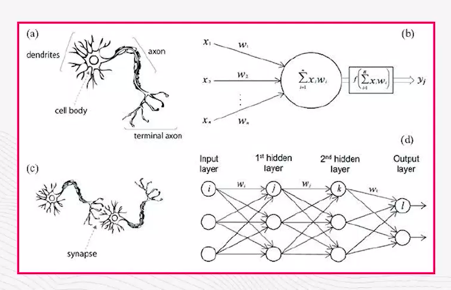

## Colônia de formigas

* Inspiradas no comportamento das formigas, os algoritmos de otimização de colônia de formigas são usadas para resolver problemas de otimização.

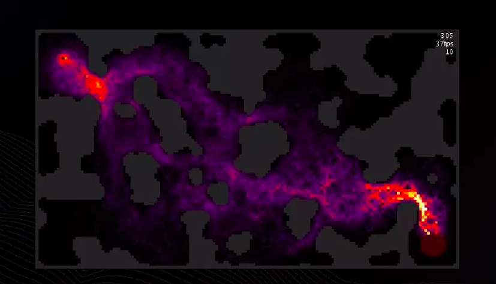

## Algoritmos Genéticos

* Os algoritmos genéticos são inspiradas na **teoria da evolução** de Charles Darwin.

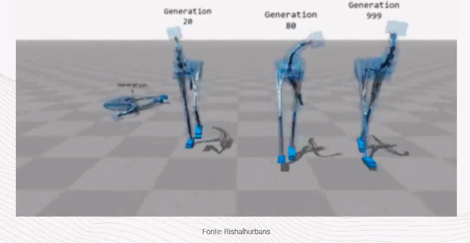

Ao longo de milhares de anos, a natureza "testou" diferentes estratégias e, por meio da **evolução**, as melhores foram **selecionadas** e aperfeiçoadas.

# O QUE É EVOLUÇÃO?

## Observações da evolução por Charles Darwin

**Pássaros de Galápagos**
* Darwin observou variações nas formas de bico de pássaros em diferentes ilhas de Galápagos.

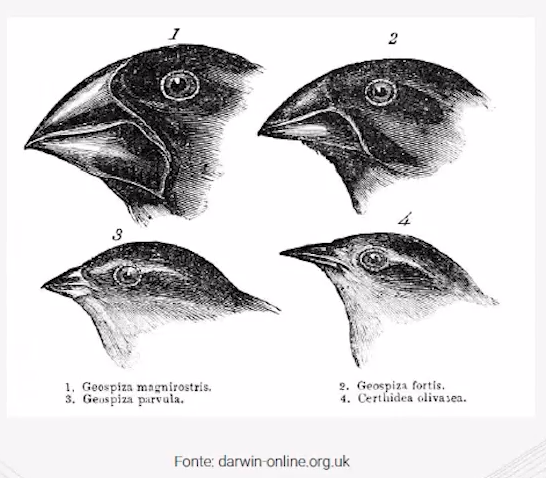

* Essas variações estavam relacionadas às fontes de alimentos disponíveis em cada ilha, demonstrando como a seleção natural levou à características específicas adaptadas às condições locais.

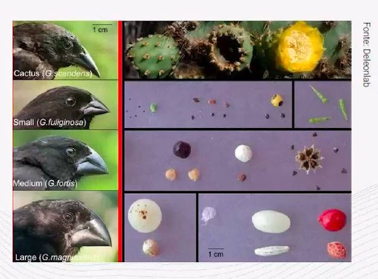

**Similaridades Anatômicas e Homologias**

A observação de similaridades anatômicas entre espécies aparentemente distintas e as homologias (órgãos semelhantes em estrutura, com com funções diferentes) surgiram uma ancestralidade comum e mudança ao longo do tempo.

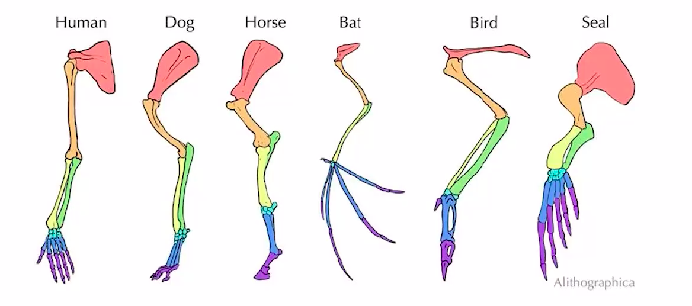

# COMO REPRODUZIR EVOLUÇÃO EM UM ALGORITMO?

(Evolução/Algoritmo)
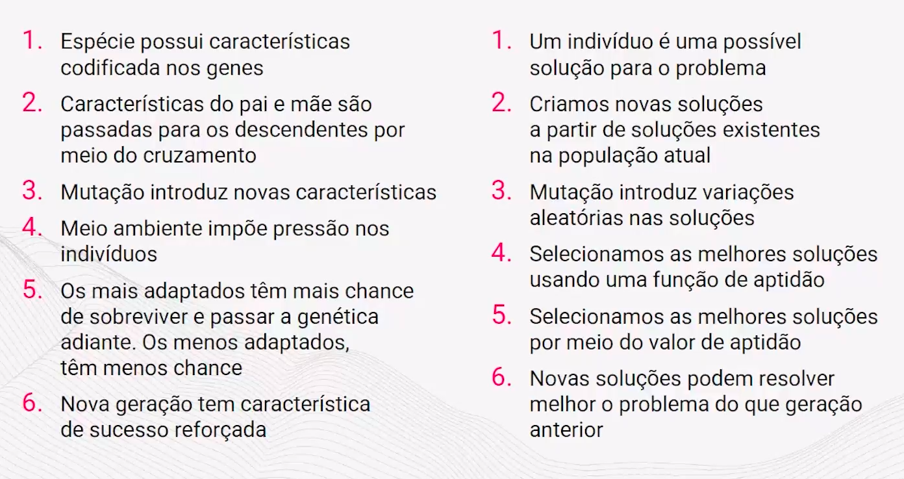

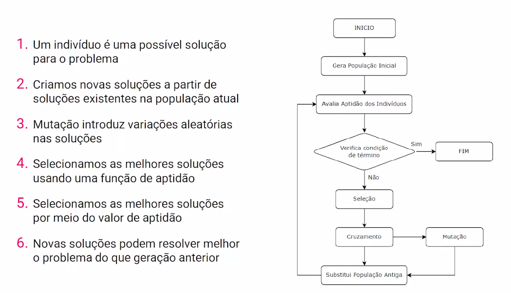

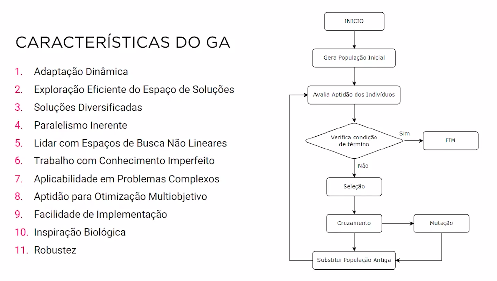

## Histórico do Algoritmo Genético

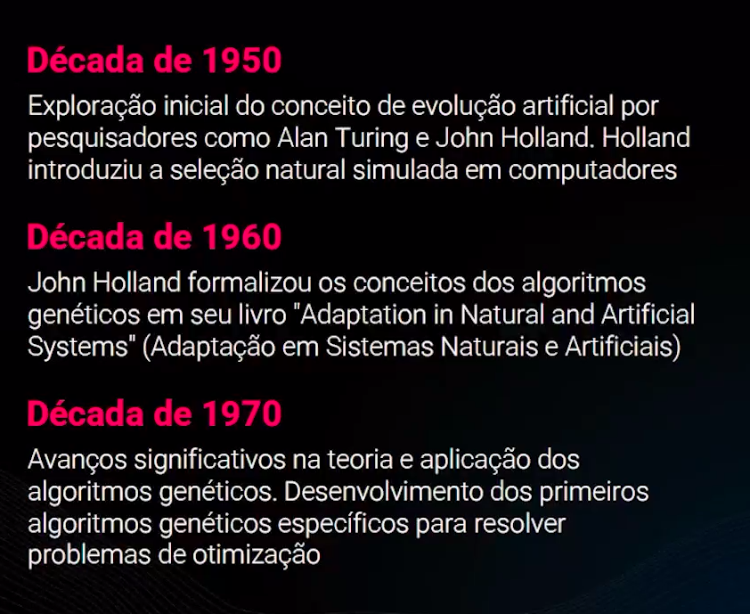

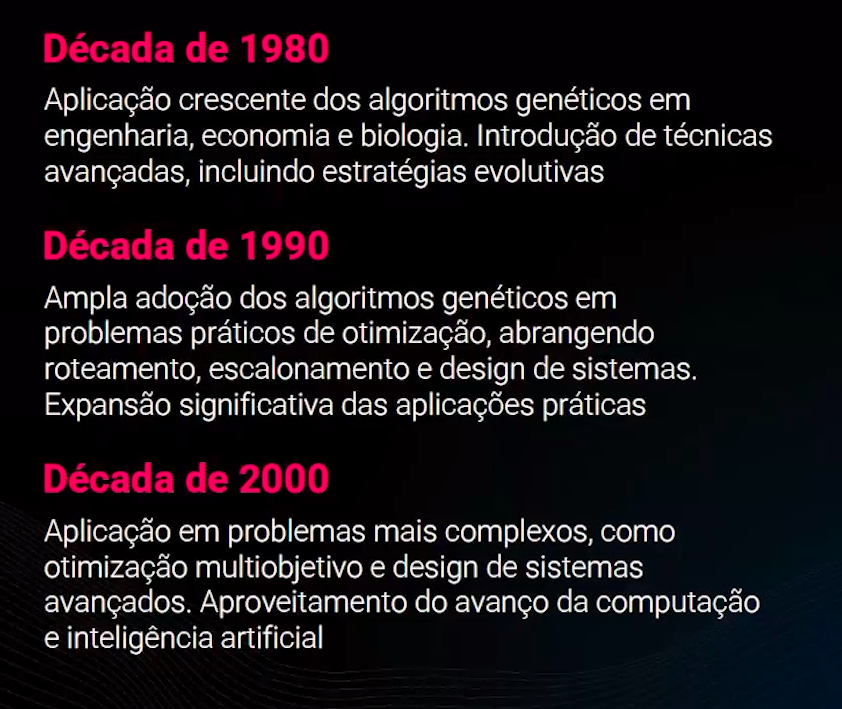

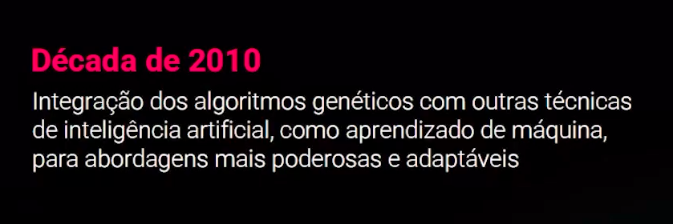

## Aplicação de Algoritmo Genético na Indústria

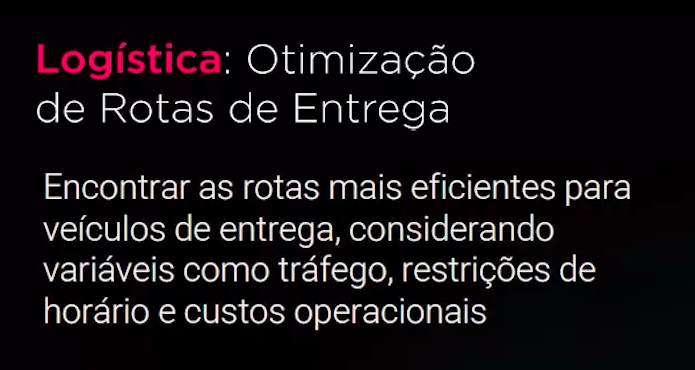

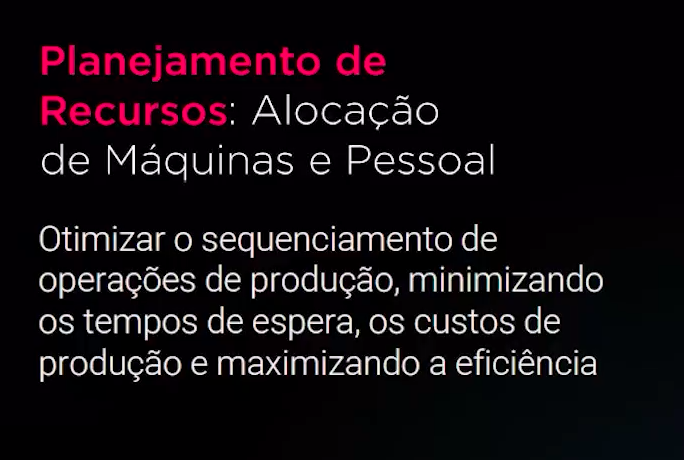

## Algoritmos Genéticos em Redes Neurais (Neuroevolution)

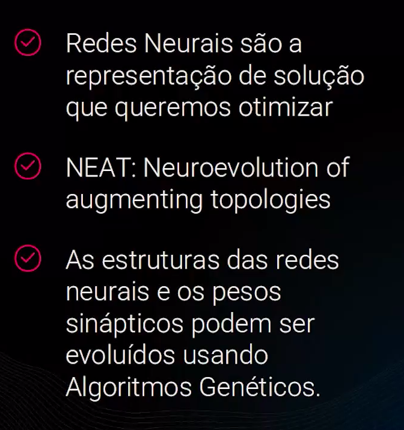

