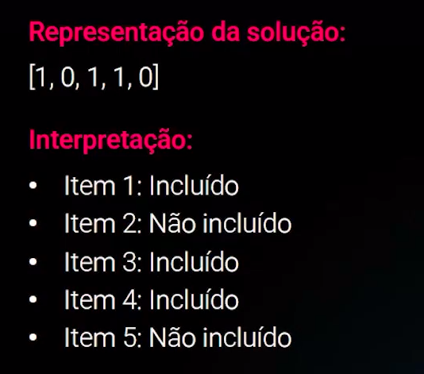
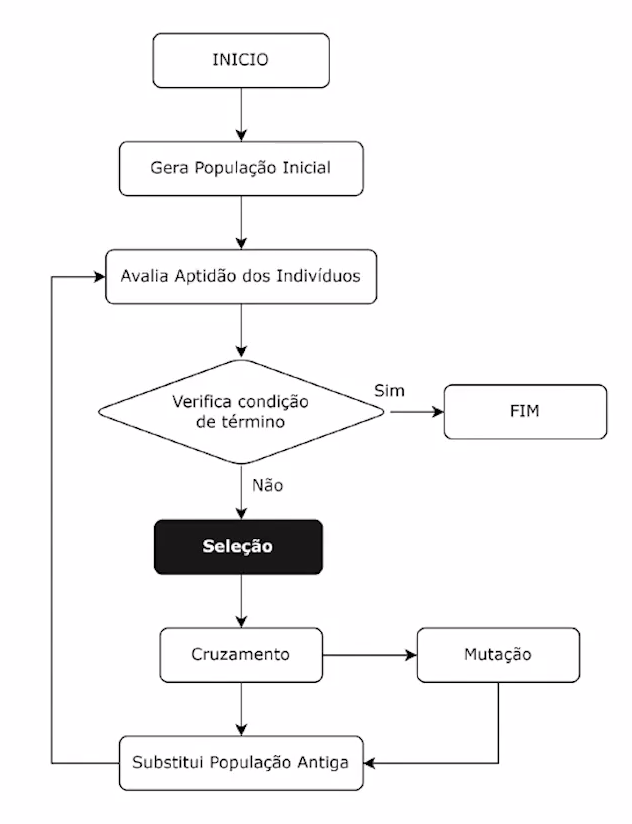
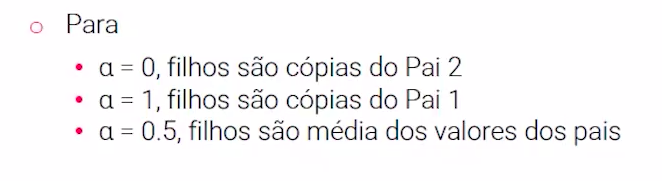

# PRINCÍPIOS E CONCEITOS FUNDAMENTAIS DOS ALGORITMOS GENÉTICOS

Nesta aula, aprofundaremos os princípios dos Algoritmos Genéticos. Revisitaremos o funcionamento do algoritmo, guiados por um diagrama que descreve cada passo. Exploraremos cada etapa, desde a codificação de soluções até os operadores genéticos, como seleção, crossover e mutação.

## Codificação de Soluções

* A codificação dos indivíduos em algoritmos genéticos refere-se à representação dos candidatos à solução (indivíduos) em uma estrutura de dados.
* A escolha adequada da codificação é crucial, pois afeta a maneira como os operadores genéticos como cruzamento e mutação, são aplicados aos indivíduos.
* Existem os tipos:
    * Codificação Binária
    * Codificação Real (ou de Ponto Flutuante)
    * Codificação Combinatória
    * Codificação Hibrida

## Codificação Binária

**Problema da Mochila (knapsack problem)**
* Temos que escolher entre um conjunto de itens para colocar na mochila com o objetivo de maximizar o valor total.
* Cada item tem um determinado valor e volume.
* A mochila tem um volume limitado.
* Qual é o conjunto de itens que vamos colocar na mochila com o objetivo de maximizar o valor somado dos itens?

## Codificação Real

**Problema: Programação de Tarefas em uma Fábrica**
* Vamos considerar um problema real de otimização de agendamento, que envolve a alocação de tempo para cada tarefa em diferentes máquinas.
* Cada solução é representada por um vetor real, onde cada componente representa o tempo de início de uma tarefa em uma máquina específica.
* Vamos considerar três máquinas (M1, M2, M3) e quatro tarefas (T1, T2, T3, T4)

**Problema: Camuflagem RGB**
* Considere um problema de camuflagem onde queremos encontrar o valor RGB de um indivíduo que seja mais parecido possível com uma determinada cor de fundo.
* Representada como um vetor real no espaço RGB, indicando as intensidades de vermelho, verde e azul.
* Por exemplo, [0.2, 0.8, 0.4] para representar uma cor específica no espaço RGB. Valores podem assumir entre 0 (canal de cor desligado) e 1 (canal de cor totalmente ligado).

## Codificação Combinatória

**Problema: Caixeiro Viajante (PCV)**
* O PCV envolve encontrar o caminho mais curto que visita todas as cidades uma vez e retorna à cidade de origem.
* A representação de uma solução pode ser feita usando uma codificação de permutação.
* Suponha que temos 5 cidades (A,B,C,D,E), e queremos encontrar a ordem ideal de visitação.

## Codificação Híbrida

**Problema: Otimização de um Design Estrutural**
* Imagine que você está otimizado o design de uma estrutura para uma ponte.
* Cada parte da estrutura pode ser representada de forma contínua, enquanto as conexões entre as partes são modeladas de maneira discreta.
* **Parte contínua:** Dimensões de uma viga ou suporte. Por exemplo, [L, W, H] para comprimento, largura e altura.
* **Parte discreta:** Conexões entre as partes contínuas. Pode ser um vetor binário indicando se as conexões estão presentes ou não.
* Essa codificação é a mais comum em problemas complexos reais.

## População Inicial

A população inicial consiste em um conjunto de indivíduos, que são representações candidatas da solução do problema. Existem várias formas de gerar essa população, incluindo:

1. **Inicialização Aleatória:** Cada indivíduo é criado aleatoriamente. 
2. **Inicialização Heurística:** Utilização de informações específicas do problema para criar indivíduos iniciais mais próximos de soluções variáveis.
3. **Inicialização a Partir de Soluções Conhecidas:** Se soluções conhecidas existirem, elas podem ser incluídas na população inicial. 

## Função de Aptidão (Fitness)

Atribui um valor numérico a cada indivíduo na população, indicando quão próximo está de ser uma solução ideal.

Essa função guia o processo de seleção, cruzamento e mutação.

Geralmente, a aptidão é maximizada ou minimizada, dependendo da natureza do problema.

Quando há mais de um objetivo a ser otimizado, uma função de aptidão multiobjetiva é usada. Geralmente, isso envolve otimizar várias funções de aptidão simultaneamente.

**Valor de fitness do indivíduo = fitness_function(individual_code)**

### Codificação Binária

**Problema da Mochila (knapsack problem)**

Dado um conjunto de itens, cada um com um peso e um valor, determine a melhor combinação de itens para maximizar o valor total, considerando uma capacidade de carga limitada.

**Função de Fitness:** Soma dos valores dos itens selecionados, sujeita a restrição de capacidade.

### Codificação Real (Ponto Flutuante)

**Problema da Otimização de Função**

Encontrar o mínimo de uma função real em um intervalo específico.

**Função de Fitness:** O valor da função objetiva.

### Codificação Combinatória

**Problema do Caixeiro Viajante (TCP)**

Determinar a rota mais curta que visita todas as cidades.

**Função de Fitness:** A distância total da rota.

### Codificação Híbrida

**Problema do Roteamento de Veículos com Coordenação Euclidianas**

Encontrar rotas ótimas para um conjunto de veículos que atendem a clientes com demandas em um espaço Euclidiano.

**Função de Fitness:** A soma das distâncias totais percorridas pelos veículos.

## Condição de Término

Define quando o algoritmo genético deve parar.

1. **Número máximo de gerações**
    O algoritmo para após um número predefinido de gerações.
2. **Convergência**
    Pode parar quando a população converge para uma solução na qual o valor de aptidão não muda após várias gerações.
3. **Alcance da solução ótima**
    O algoritmo para quando solução aceitável é encontrada.

## Seleção

* A seleção é o mecanismo pela qual os indivíduos mais aptos são escolhidos para reprodução, enquanto os menos aptos têm menos chance de serem pais na próxima geração

* Conceitos fundamentais do processo da seleção:
    * Pressão de Seleção
    * Convergência Prematura
    * Diversificação
    * Elitismo

### Pressão de Seleção

* Refere-se à intensidade com que os indivíduos mais aptos são favorecidos em relação aos menos aptos durante a seleção.
* Uma pressão de seleção adequada é crucial para **equilibrar a exploração** do espaço de busca e a convergência para soluções ótimas.

### Convergência Prematura

* Ocorre quando a população convergir muito rapidamente para uma solução, muitas vezes sub-ótima, antes de explorar adequadamente o espaço de busca.
* Evitar convergência prematura é crucial para garantir que o algoritmo genético não fique preso em ótimos locais e tenha a chance de encontrar soluções mais globais.

### Diversificação

* Refere-se à manutenção da diversidade genética na população ao longo das gerações.
* Manter a diversificação ajuda a explorar diferentes regiões do espaço de busca, aumentando a probabilidade de encontrar soluções melhores.

### Elitismo

* Envolve preservar os melhores indivíduos da população atual na próxima geração, independentemente da seleção.
* Ajuda a garantir que as melhores soluções não se percam ao longo do tempo, melhorando a estabilidade e a convergência do algoritmo.

### Métodos de Seleção

* Roleta (ou Proporcional)
* Torneio
* Ranking

### Roleta (ou Proporcional)

A probabilidade de um indivíduo ser escolhido é proporcional à sua aptidão à população.

**Vantagens**
* Simplicidade de implementação.
* Representação suave da aptidão relativa.

**Desvantagens**
* Suscetível a convergir prematuramente se a pressão seletiva for muito alta.
* Pode não ser eficiente quando há grandes discrepâncias nas aptidões.

Menos propenso a manter a diversidade em comparação com outros métodos.

### Torneio

Vários indivíduos são escolhidos aleatoriamente e competem entre si, o vencedor é selecionado para reprodução.

**Vantagens**
* Robusto em relação a variações nas escalas de aptidão.
* Facilidade de implementação.

**Desvantagens**
* Ajustar o tamanho do torneio afeta a pressão seletiva e a diversidade.

### Ranking

Os indivíduos são ordenados por aptidão, e a seleção é baseada na posição da lista.

**Vantagens**
* Menos sensível às variações nas escalas de aptidão.
* Pode ajudar a manter a diversidade.

**Desvantagens**
* Menos eficiente computacionalmente especificamente em grandes populações.

## Cruzamento

* O cruzamento envolve a combinação de material genético de dois para gerar descendentes, que herdam características de ambos pais.
* É um método que recombina a estrutura de dados dos pais para gerar um novo indivíduo, que possuíra características distintas, herdadas dos pais.
* Existem diferentes tipos de mutação, e que são adequadas para diferentes tipos de codificação da solução.

### Cruzamento para Codificação Binária

**Single-Point Crossover**
* Um ponto de corte é escolhido aleatoriamente nos cromossomos dos pais.
* Os bits à esquerda do ponto de corte de um pai são combinados com os bits à direita do ponto de corte do outro pai para gerar descendentes.   

### Cruzamento para Codificação Real

**Arithmetic Crossover**
* Para cada componentes do vetor dos pais, o valor do filho é uma combinação linear dos valores dos pais, ponderada por uma constante alpha.

**Uniform Crossover ou One-Point Crossover**
* Para cada elemento nos vetores, uma decisão aleatória é tomada para manter o elemento do primeiro pai ou trocá-lo como o elemento do segundo pai.
* Esse processo é repetido para cada elemento independente, resultando em uma mistura de material genético de ambos os pais.

### Cruzamento para Codificação Combinatória

**Order Crossover (OX1)**
* Esse operador é projetado para preserver a ordem relativa dos elementos na soluções, garantido que os descendentes gerados também sejam permutações válidas.
* Em problemas combinatórios, não é permitido repetir elementos na codificação.
* Método de cruzamento não pode produzir soluções inválidas para o problema.

### Cruzamento para Codificação Híbrida

* O crossover para codificação binária pode ser uma mistura de diversos métodos do crossover que vimos de diversos métodos de crossovers que vimos para os diferentes tipos de dados da codificação do indivíduo.
* Cada tipo dado dentro da codificação híbrida pode sofrer um tipo específico de cruzamento.
* A ideia central de todas as técnicas de crossover é criar novas soluções (filhos) por meio da combinação de soluções existentes (pais).
* O método de crossover precisa produzir filhos que são soluções válidas para o problema. Precisa respeitar as restrições do problema.

## Mutação

* A mutação é um operador genético fundamental a exploração por busca por soluções novas e inéditas.
* Ela atua como um mecanismo de introdução de variação no material genético, desempenhando um papel crucial na exploração do espaço de busca e evitando a convergência prematura para ótimos locais.
* Dois parâmetros que controlam a mutação:
    * Probabilidade de mutação
    * Intensidade da mutação

**Mais mutação**
* Mais exploração
* Menos aproveitamento
* Mais diversidade
* Risco de destruir genética
* Menor chance de melhorar boas soluções já existentes.

**Menos mutação**
* Menor exploração
* Maior aproveitamento
* Risco de convergência prematura
* Maior chance de aperfeiçoar soluções já boas

Existe diferentes tipos de mutação, para diferentes tipos de codificação:
    * Mutação **Bit Flip** - Codificação Binária
    * Mutação **Gaussiana** - Codificação Real
    * Mutação **por Inversão** - Codificação Combinatória

Para codificação híbrida, pode-se misturar os diferentes tipos de mutação que serão aplicados nos diferentes tipos de dados da codificação.

### Mutação para Codificação Binária

**Mutação Bit Flip**

Seleciona aleatoriamente um ou mais bits e inverte seus valores.

### Mutação para Codificação Real

**Mutação Gaussiana**
* Adiciona um valor aleatório com distribuição gaussiana ao gene.
* Quanto maior a intensidade da mutação, maior o intervalo de distribuição gaussiana, logo, maior a chance de uma mutação mais forte.
* Aleatoriamente, pode acontecer uma mutação muito forte com a probabilidade dada pela distribuição normal.

### Mutação para Codificação Combinatória

**Mutação por Inversão**
* Inverter a ordem de um subconjunto de genes no cromossomo.
* Quanto mais forte a mutação, maior o intervalo selecionado para ser invertido.

## Substituição da População

É o processo de atualizar a geração atual da população com os descendentes gerados a partir de operações genéticos, como crossover e mutação.

Existem alguns tipos de fazer a substituição da população antiga:

**Geracional**
* Toda população antiga é descartada e a nova população é composta apenas pelos novos filhos.
* Maior exploração, melhor aproveitamento.

**Elitista**
* Os melhores indivíduos da geração anterior são mantidos para a próxima geração.
* Menor exploração, mair aproveitamento.

