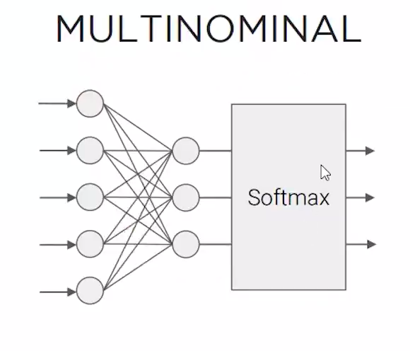
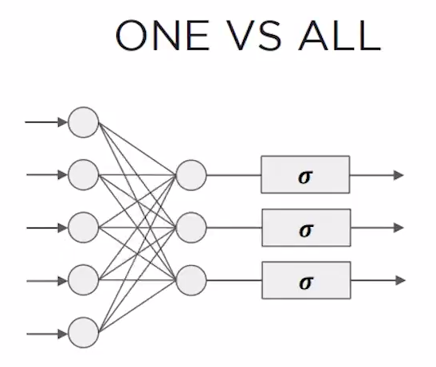
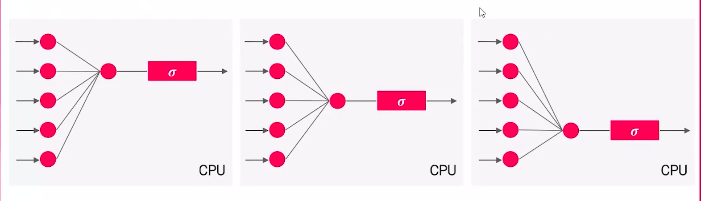
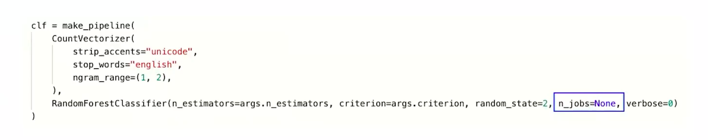
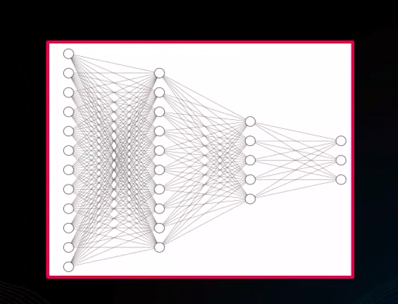
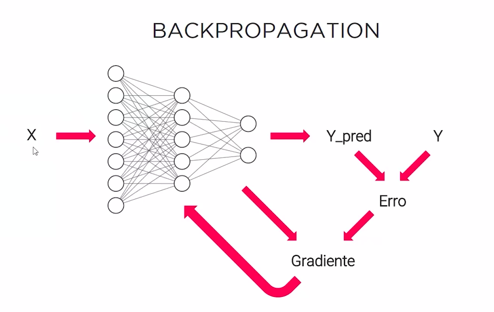
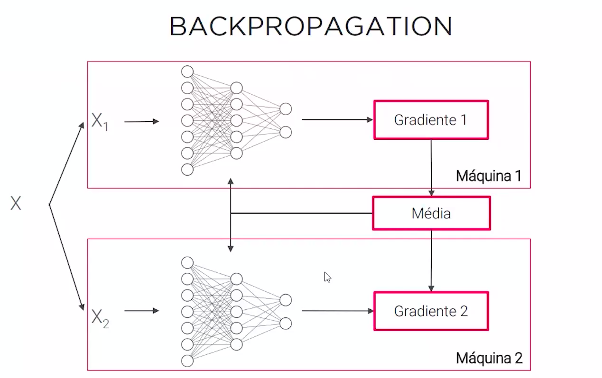

# FASE 2 - AULA 3 - RECURSOS ESCALAVEIS E ALTO DESEMPENHO

Como escalar recursos e aumentar o desempenho no Azure.

## Problemas para treinar modelos localmente

* Recursos limitados
* Recursos não escaláveis
* Demora na conclusão
* Demora na iteração com modificações

## Possibilidades com a nuvem

* Recursos elásticos sob demanda
* Mais experimentos em menos tempo
* Permite o processamento de modelos de tamanhos elevados

## Como treinar modelos com recursos paralelos?

* Treinar diferentes modelos (AutoML)
* Treinar o mesmo modelo com hiperparâmetros diferentes
* Treinar componentes independentes de um modelo

## AutoML

Testar diversos modelos com os dados para ver qual performa melhor. O AutoML ajuda a subir vários modelos, de dezenas a centenas, e a escolher qual o melhor modelo.

**forma natural de treinamento:**

DADOS -> MODELO -> SÁIDA

**forma de paralelismo de treinamento:**
```txt
        ↗   MODELO 1    ➙  SAÍDA
        ↗   MODELO 2    ➙  SAÍDA
DADOS   ➙   MODELO 3    ➙  SAÍDA
        ↘   MODELO N    ➙  SAÍDA
```

## Relembrando as limitações de um ambiente local

**Problemas para treinar modelos localmente:**
* Recursos limitados
* Recursos não escaláveis
* Demora na conclusão
* Demora na iteração com modificações

**Possibilidades da nuvem:**
* Recursos elásticos sob demanda
* Mais experimentos em menos tempo
* Permite o processamento de modelos de tamanhos elevados

### Como treinar modelos com recursos paralelos

* Treinar diferentes modelos (AutoML)
* Treinar o mesmo modelo com hiperparâmetros diferentes
* Treinar componentes independentes de um mesmo modelo

### AutoML: Testar diversos modelos com os dados para ver qual performa melhor

**Forma padrão de treinamento**
dados -> modelo -> saída

**forma de paralelismo de treinamento:**
```txt
AutoML
        ↗   MODELO 1    ➙  SAÍDA (CPU)
        ↗   MODELO 2    ➙  SAÍDA (CPU)
DADOS   ➙   MODELO 3    ➙  SAÍDA (CPU)
        ↘   MODELO N    ➙  SAÍDA (CPU)
```

## Criando um cluster de computação

Cluster de computação são várias máquinas (normalmente máquinas iguais), onde gerencimos todas elas como uma só máquina, podendo subir ou deburrar máquinas de acordo com a necessidade.

### Criando um cluster

* Ir no workspace
* Clicar em Computação -> Cluster de computação -> Novo -> Fazer as configurações e Avançar -> Fazer as configurações e Criar
* Para ver os cluster ir em Computação

### Criando um modelo utilizando cluster

* Clicar em Notebooks
* Criar um arquivo do tipo notebook
* Seguir os da aula pra criar um modelo com AutoML
* O AutoML basicamente faz quase tudo, então de acordo com os dados o AutoML vai escolher os modelos mais promissores, ajustes de parâmatros, a quantidade de máquinas que serão usadas, ...
* Ao utilizar o AutoML é muito importante **limitar o tempo e o máximo recursos utilizados** no treinamento, caso contrário, o custo por treinar algum modelo pode ser muito alto.
* Para ver o status do modelo só ir em Tarefas (Jobs).
* Para quais modelos o AutoML utilizou ir em Tarefas (Jobs) -> selecionar o modelo -> Modelos + trabalhos filho

## Hyperparameter Tunning

Testar diversos modelos com diferentes hiper parâmetros.

```txt
Hyperparameter Tunning

        ↗   MODELO CONFIGURAÇÃO 1    ➙  SAÍDA (CPU)
        ↗   MODELO CONFIGURAÇÃO 2    ➙  SAÍDA (CPU)
DADOS   ➙   MODELO CONFIGURAÇÃO 3    ➙  SAÍDA (CPU)
        ↘   MODELO CONFIGURAÇÃO N    ➙  SAÍDA (CPU)
```

* Ir em Notebooks e criar uma pasta e a um arquivo do tipo python. Seguir a aula.
* Criar um notebook para chamar o script. Seguir a aula.

## paralelizar modelos de treinamento e conjuntos de hiperparametros já definidos

### Componentes dependentes

modelo
```text
Entrada ➙ [comp1] ↘
                     [comp2] ↘
                               [comp3] ↘
                                         [compN] ➙ saída
```

Exemplo: Gradient Boosting Tree
```text
Entrada ➙ [Árvore1] ↘
                     [Árvore2] ↘
                                [Árvore3] ↘
                                           [ÁrvoreN] ➙ saída
```

### Componentes Independentes

modelo
```text
        ↗   Comp1 (CPU)  ↘   
Entrada ➙   Comp2 (CPU)  ➙  Agregação  ➙  Saída
        ↘   Comp3 (CPU)  ↗
        ↘   CompN (CPU)  ↗
```

Exemplo: RandomForests
```text
        ↗   Arvore1 (CPU)  ↘   
Entrada ➙   Arvore2 (CPU)  ➙  Votação  ➙  Saída
        ↘   Arvore3 (CPU)  ↗
        ↘   ArvoreN (CPU)  ↗
```

### Modelos Lineares

* Regreção logística
* Suport vector machines

Saída
* Multinomial
* OVA (One Vs All)

As saídas são dependentes<br/>


As saídas são indepdendetes<br/>


Como o one vs all as saídas são indepdendetes, é possível criar uma sequência de modelos<br/>


### Paralelizando componentes independentes

O sklearn possui um parâmetro paralizar modelos no RandomForestClassifier.



### Modelos Profundos

* Modelos com diversas camadas
* Alto custo computacional
* Componentes dependetes
* Alta qualidade de resultados



**Dados Paralelos**

* Podemos paralelizar o treinanemento de componentes independentes
* Alguns modelos não tem uma independência de componentes
* Paralelizar os dados

Fluxo normal do deep learning<br/>


Fluxo deep learning com paralelização

* O modelo é duplicado
* Os dados são divididos
* Será feito uma média de cada gradiante dos modelos
* Com a média as redes do modelos são atualizadas para que todos estejam em sintonia
* O processo se repete



### Criando um modelo deep learning com paralelização

O objetivo do modelo é identifcar números escritos por pessoas.

* Ir em Notebooks e criar uma pasta chamada mnist.
* Criar um script python chamado mnist.
* Criar uma rede neural em tensorflow (seguir a aula).
* Criar um notebook para chamar o script de treinamento (seguir a aula).

## Conclusão

* Testar diferentes modelos costuma ser demorado
* Necessário acelerar treinamentos e testes
* Utilizar recursos paralelos para treinamento
* Diferentes modelos
* Diferentes hiperparâmetros
* Paralizar dados
