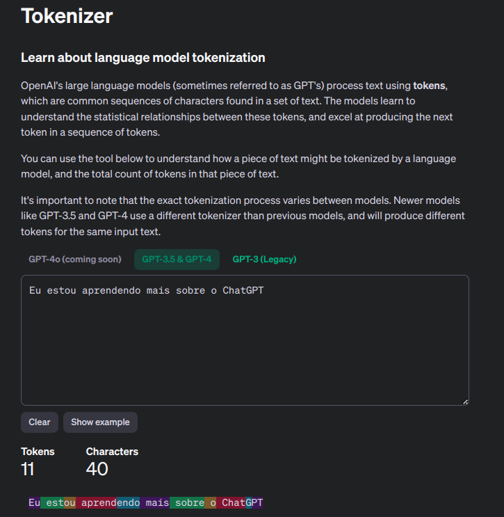
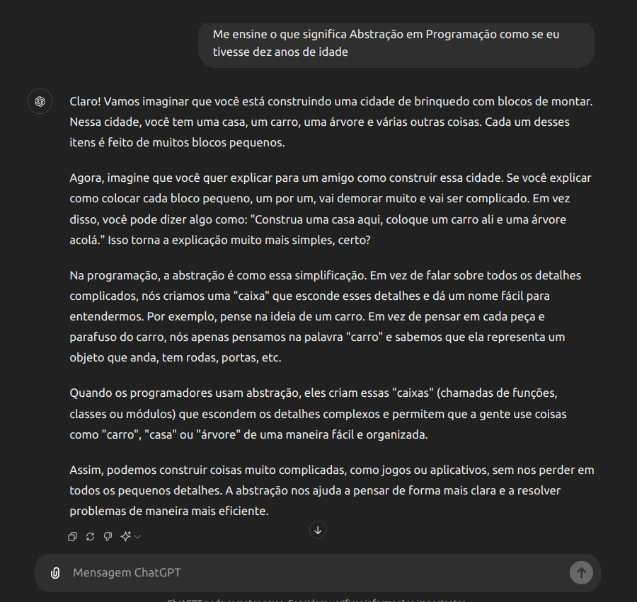
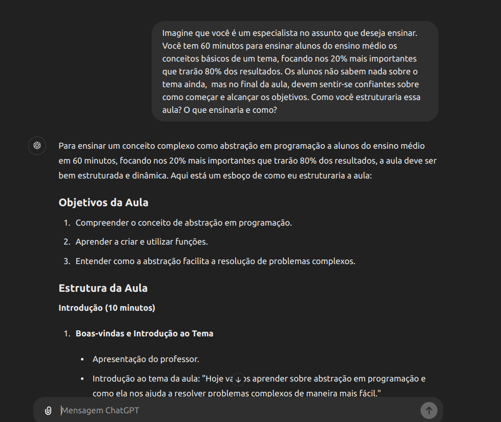

# O que é o ChatGPT

* Generative Pre-trained Transformer (GPT)
    * Explicando de forma simples, o ChatGPT é um robo conversador.
    * Generative: Utiliza o modelo de IA generativa para criar novos dados a partir dos dados já estabelecidos.
    * Pre-trained: Modelo pré treinado.
    * Transformer: Arquitetura utilizada para entender a nossa linguagem.
* Tokenização: O ChatGPT utliza a tokenização para conseguie adivinhar a próxima palavra de acordo com o contexto.
* Site OpenIA - tokens: A OpenIA disponibiliza um site que mostra como a tokenização funciona.
    * https://platform.openai.com/tokenizer

    
* Cookbook: Manual da OpenIA de como utilizar melhor o ChatGPT.
    * https://cookbook.openai.com/

## Exemplo de como utlizar o ChatGPT

https://chatgpt.com/

Para poder utilizar precisamos passar o nosso prompt. Quanto melhor o prompt melhor será a resposta.

Dependendo de como fazemos o prompt a resposta do ChatGTP pode mudar. Utlizando a **técnica da aula fictícia** podemos ter uma resposta simples, porém detalhada do que queremos.

## Ética e Compliance no uso do modelos de IA

* Transparência com IA
* Monitorar preconceitos
* Normalizar o Uso de IA
* Segurança de dados

## Privacidade e Confidencialidade

* A ética e compliance no uso de IA
* Privacidade dos dados
* LGPD (Brasil)
* Cuidade com dados
* Proteja a privacidade

## O ChatGTP pode errar

O ChatGPT não é perfeito, podendo gerar informação equivocadas ou até grosseiramente erradas dependo do assunto. Em informações do tipo factual o ChatGTP tende a ter alucinações, ou seja, inventar respostas sem sentido ou com informações incorretas. Nesse caso é importante sempre checar as informações antes de usá-la.

* Confie, mas verifique
* Dividir tarefas grandes
* Experimente
* Um grande assunto por conversa
* Explore
* Prefira o inglês
