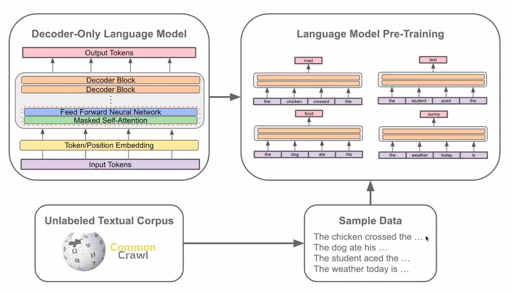
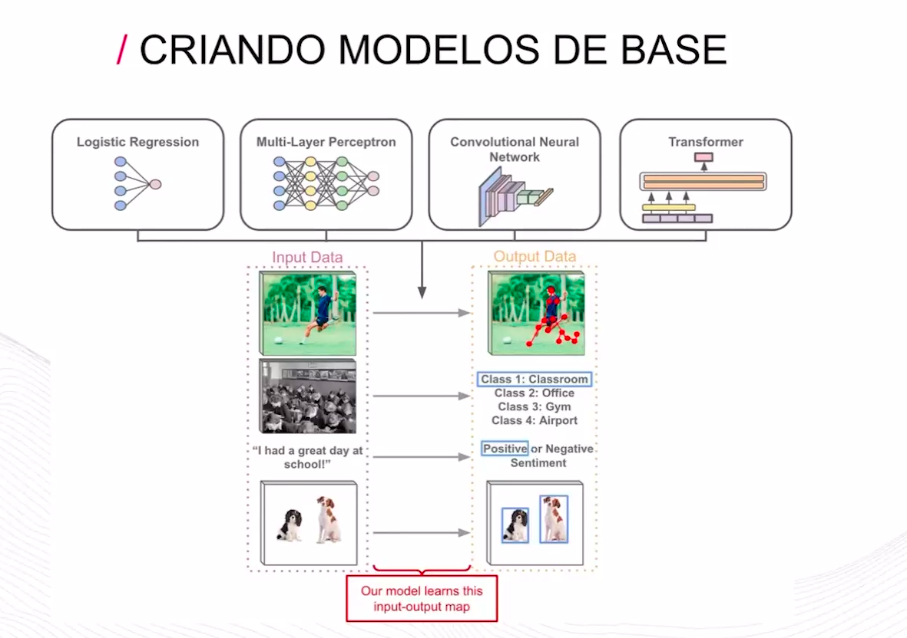
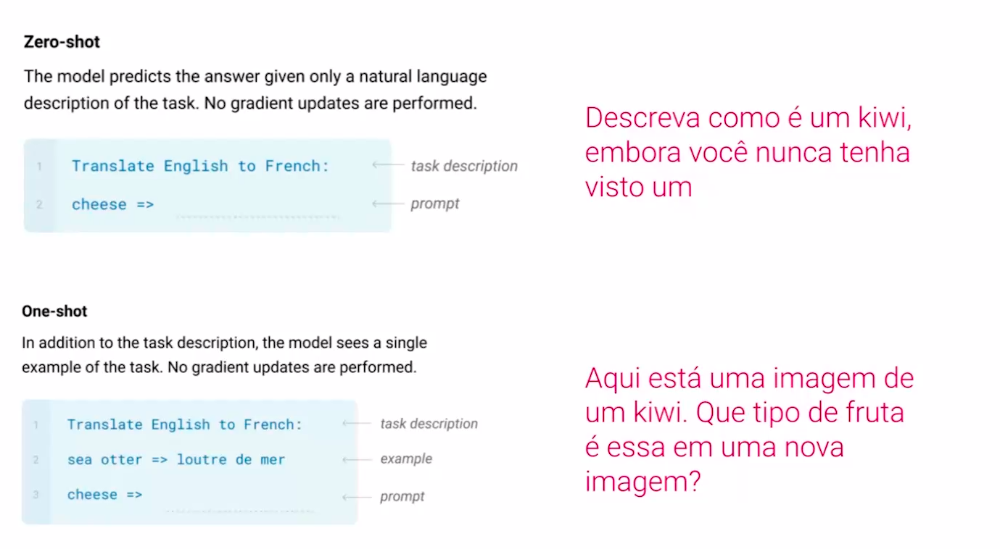

# Boas Práticas de IA e Chains of Thoughts com Base Ciêntifica em LLMs

Nesta aula, vamos explorar os grandes modelos de linguagem (LLMs), destacando seus pontos fortes e limitações. Vamos nos aprofundar na técnica de "Chains of Thought" ("Cadeia de Pensamento"), uma abordagem eficaz para melhorar o desempenho dos LLMs em tarefas complexas e que exigem raciocínio lógico.

## LLM's

Sistemas de inteligência artificial que utilizam redes neurais profundas para processar e gerar linguagem natutal.

São Treinadas com grandes volumes de texto, gerando algumas vantagens:
* Tradução
* Classificação de textos
* Elaboração de resumos

Porém também existam alguns desafios, alguns assuntos pode ter algum trabalho para se trabalhar, como:
* Raciocínio lógico
* Matemática    

## Aprimorando a IA com a "Cadeia de Pensamento"

A técnica de "Cadeia de Pensamento" (Chains of Thought) é uma técnica para melhorar as capacidades dos LLMs para resolver melhor tarefas mais complexas que incluem raciocínio lógico e matemática.

* Método que ensina os modelos a resolver problemas passo a passo
* Resultados promissores
* Maior capacidade para tarefas complexas da raciocínio 
* Maior eficiência na resolução de problemas

## Modelos de linguagem aprendem com poucos exemplos

* A OpenIA disponibilizou um artigo chamado "Modelos de Linguagem Aprendem com Poucos Exemplos"
* O arigo traz alguns conceitos: "zero-shot" e  "few-shot-learning"
* Shot -> Exemplo ou amostra
* Learning -> Aprendizado

## Prompting e aprendizagem com poucos exemplos

* Treinamento direcionado (GPT)
    * Aprendizados específicos, associando comandos a uma ação específica
    * Eficaz para taferas definidas
    * Pode ficar confuso caso seja exposto em situações não treinadas
* Treinamento geral (GPT-2)
    * Exposição em várias situações específicas a deixar o modelo aprender sozinho
    * Desenvolvimento generalizado, porém leva mais tempo de treinamento e precisa de algumas orientações

## GPT-3

A diferença do GPT-3 é quantidade de parâmetros. Foi descoberto que modelos de lingugens com muitos parâmetros conseguem aprender com bem poucos exemplos.

* O GPT-3 tem em torno de 175 bilhões de parâmetros
* A quantidade de parâmetros ajudam a trazer melhores resultados só fazendo ajustes finos nos prompts
* Essa descoberta fez criar um novo campo de estudo focado em prompts de comandos, chamada **Engenharia de Prompt**
* Engenharia de Prompt busca entender quais são as melhores formas de otimizar os prompt para trazer melhores resultados dos grandes modelos.
* A Google possui um artigo que diz que pequenas mudanças nos prompts trazem grandes mudanças de desempenho nas repostas dos modelos. (Artigo: **Chains-of-Thought Prompting Elicits Reasoning in Large Language Models**)

