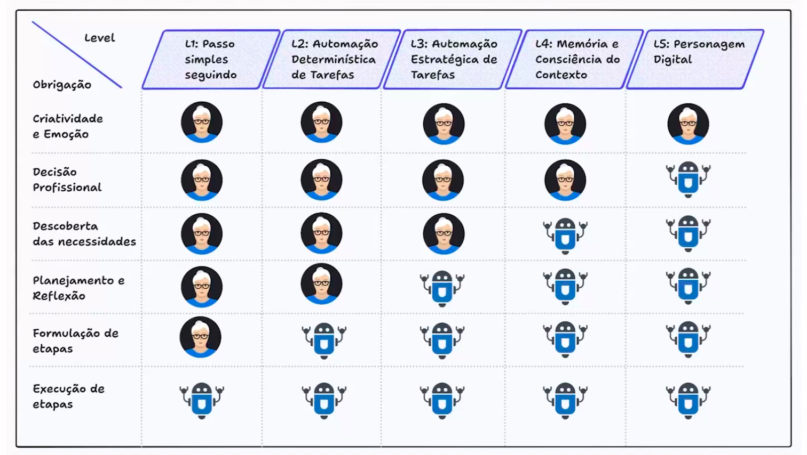

# Trajetória dos Assitentes Pessoais

Nesta aula, abordaremos conceitos de Agentes Pessoais, uma categoria de agentes que se baseiam no LLM e que estão profundamente integrados aos dados e dispositivos pessoais, sendo empregados para fornecer assistência personalizada. Abordaremos tanto a história, quanto a evolução dos assistentes e, também, conheceremos o modelo GPT-4o, lançado pela OpenAI em maio de 2024.

## Programação baseada em modelos

* Modelos predefinidos de tarefas
* Automoção de tarefas recorrentes
* Confiabilidade versus flexibilidade
* Limitações e frustações do usuário

## Métodos de apredizado por reforço

* Automação via interação e recompensa
* Flexibilidade do RL em relação ao aprendizado supervisionado
* Estratégias para otimizar o aprendizado em ambientes complexos

## Níveis de inteligência dos agentes pessoais

* L1 - Passo simples
* L2 - Automação determinística de tarefas
* L3 - Automação de tarefas estratégicas
* L4 - Memória e conciência do contexto
* L5 - Personagem digital

## GPT3 VS GPT4

* Tamanho do modelo -> 175 bilhões de parâmetros / Significamente maior
* Capacidades de raciocínio e tarefas: O GPT4 tem melhor capacidade de raciocínio
* Mais preciso em tarefas complexas
* Segue melhor instruções detalhadas

## GPT4o

Funcionalidades Avançadas:
* Assitentes virtuais
* Educação e treinamento
* Conformidade com LGPD
