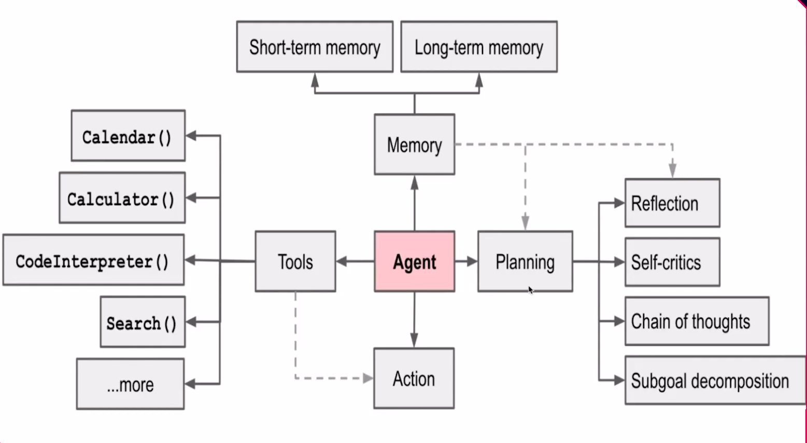
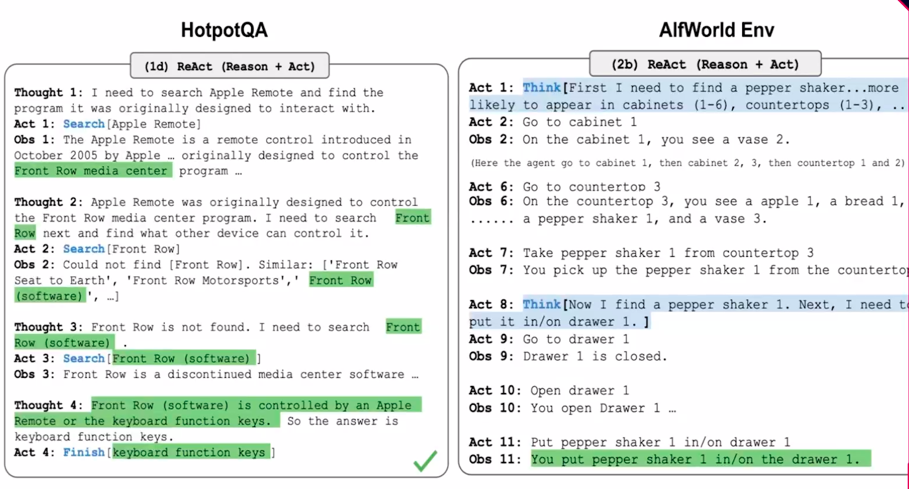
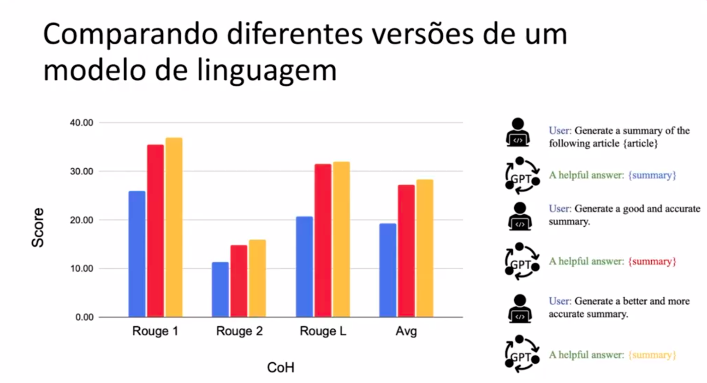
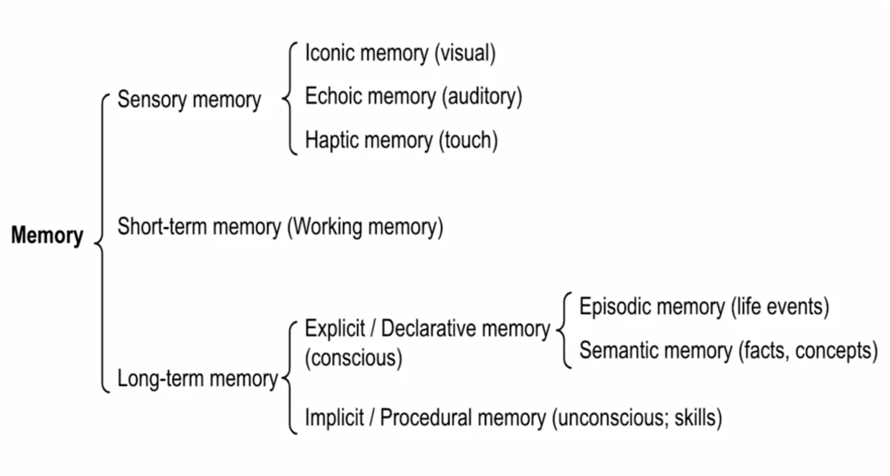
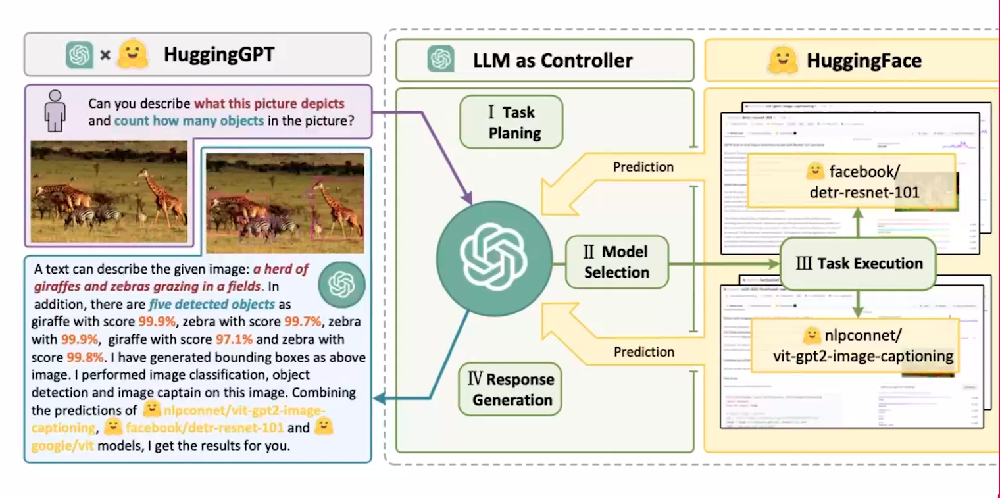

# Explorando Aplicações Avançadas com LLMs

Nesta seção, você adentrará o fascinante mundo dos Modelos de Linguagem de Grande Escala (LLMs), e verá como eles podem ser aprimorados com o uso de ferramentas externas para ultrapassar suas capacidades inerentes. Vamos explorar as arquiteturas inovadoras que permitem a esses modelos executarem tarefas complexas, indo além do processamento de linguagem natural para interagir com o mundo por meio de APIs externas.

## Como funciona um Agente com LLM?

* Dividindo tarefas
* Melhorando com o tempo
* Memória de curto prazo
* Mémória de longo prazo
* Acessando ferramentas externas

## Como LLMs podem resolver tarefas complexas

* Decomposição de Tarefas com Cadeia de Pensamento (Cot)
* Árvores de Pensamentos
* Uso de Prompts e Planejamento
* LLM+P (Planejamento Externo)
* Auto Reflexão
* ReAct - Raciocínio e Ação

**HotpotQA:** checa se a IA consegue ler várias informações e responder o que ela entendeu.

**AlfWorld Env:** A IA fica em um ambiente virtual e interage com o ambiente para aprender.

## Como os LLMs selecionam a ferramenta externa certa para uma tarefa específica?

* Análise da Solitação
* Escolha da Ferramenta
* Prevenindo Sobreajuste
* Evitando Atalhos e Cópias
* Conjunto de Dados de Treinamento

## Tipos de Memórias

* Memória Sensorial
* Memória de Curto Prazo
* Memória de Longo Prazo (MLP)
* Memória explícita

## Uso de ferramentas

* MRKL (Raciocínio Mudular, Conhecimento e Linguagem)
* TALM e Toolformer
* HuggingGPT

