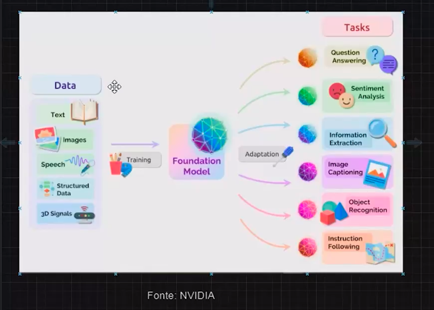
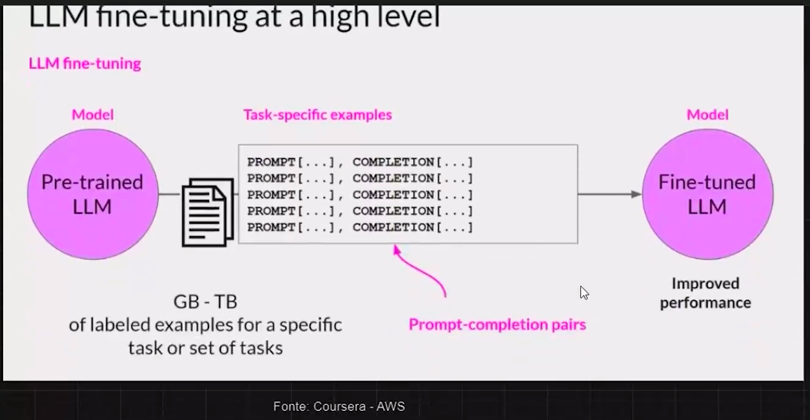

# FASE 3 - FINE-TUNING E RAG PARA DOCUMENTOS - FINE-TUNING DE LLMs PARA DOCUMENTOS

Vamos entender o que é fine-tuning de LLMs, o que são foundation models e vamos executar o treinamento com base nos dados preparados na aula anterior. Entenderemos como configurar o modelo Llama 2, de 7 bilhões de parâmetros, e conceitos-chaves como tokenização de texto, quantitização, transformers e adaptadores LoRA. 

Após essa aula, você terá uma base sólida para conseguir realizar fine-tuning em diferentes modelos, uma vez que os conceitos passados aqui serão úteis para outros tipos de LLMs que você venha a usar futuramente.

Vamos considerar que você é um engenheiro de inteligência artificial em um grande conglomerado de notícias e os acessos ao site vêm caindo cada vez mais ao longo dos anos com o crescimento das redes sociais. Cada vez mais, vê-se a tendência das plataformas “batalhando” entre si pelo tempo e atenção dos usuários. Portanto, analisando o tempo médio de leitura dos artigos do site, você conclui que eles extrapolam o tempo médio da sessão de usuário. 

Para não impactar a qualidade dos artigos ou alterar processos internos que fogem da sua alçada, você decide criar uma inteligência artificial que resuma os textos integrais. Esse resumo permitirá ao usuário absorver os principais pontos e, se despertar o interesse, o encaminhará para a matéria completa. 

Apesar do caso ser hipotético, as possibilidades que os LLMs proporcionam são reais e já impactam múltiplos setores da economia. 

Nesta aula, vamos realizar o fine-tuning em um modelo de linguagem open source para resumir matérias de jornal, compreendendo os conceitos gerais para que você seja capaz de aplicar nos problemas que enfrenta no seu dia a dia.

* **Data**: Coleta de dados gerais.
* **Fundation Model**: Fase de pré-treinamento com os dados coletados. Está fase serve para que o modelo tenha um tipo de "conhecimento geral" antes de especializar em um tipo específico de conhecimento.
* **Task:** Especialização do **Fundation Model**. Após o treinamento geral, podemos treinar o modelo para que se especialize em um conhecimento ou tarefa específica.

**OBS**: Acessar o canal **3Blue1Brown** para entender a IA de forma matemática.

## Fine-Tuning

Fine-tuning é basicamente especialiazar um modelo. Explicando de maneira simples, para chegar em um modelo especializado é preciso de um modelo já treinado. Com o modelo treinado iremos utilizar as respostas desse modelo, de forma estruturada, para treinar a especialização, ou seja, não é preciso criar um modelo do zero e treinar ele, basta utilizar as respostas do modelo pré-treinado, estruturar as respostas de forma adequada para o treinamento de especialização e aplicar.