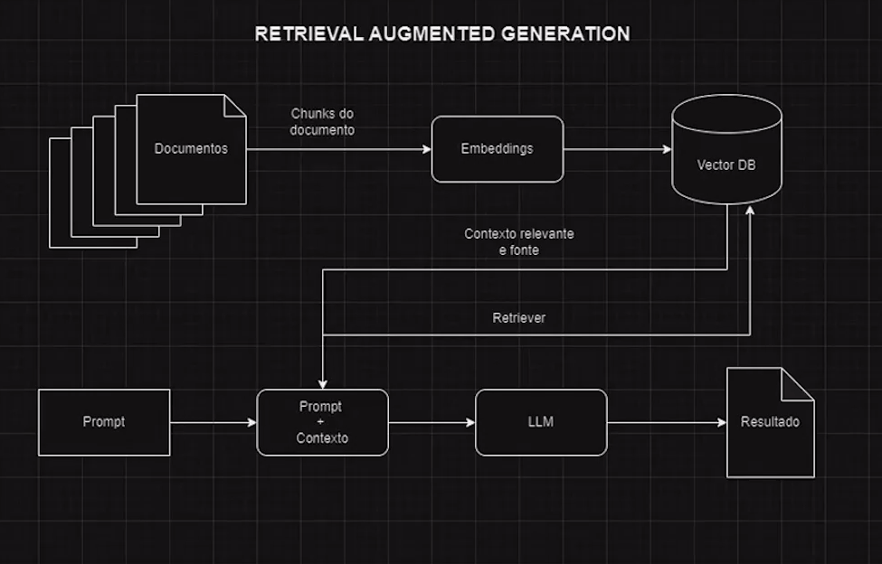

# FASE 3 - FINE-TUNING E RAG PARA DOCUMENTOS - RAG PARA DOCUMENTOS

Por vezes não basta somente construir uma inteligência artificial que processe linguagem natural. E se for necessário que o modelo retorne a fonte que a IA utilizou para responder sobre determinado tópico? É aqui que entra o RAG, ou Retrieval Augmented Generation. Esse método inovador combina o poder dos modelos de linguagem baseados em transformadores com ferramentas de recuperação de informação e fonte, criando uma abordagem híbrida que potencializa as possibilidades de modelos de geração de texto.

O RAG agrega valor ao output fornecido pela IA, buscando informações em tempo real para embasar o retorno e aumentar sua relevância e precisão do texto gerado, mas também abre novas possibilidades para aplicações práticas, desde assistentes virtuais até ferramentas de pesquisa avançada.

Nesta aula, vamos aprender como implementar RAG para que a resposta de nosso modelo retorne o conteúdo e a sua fonte (nesse caso, o link da notícia).

Considere como uma IA com RAG pode agregar valor em uma empresa jornalística, por exemplo. Se é solicitado a um analista de dados dessa empresa que retorne todas as matérias já publicadas sobre determinado tema, será preciso utilizar alguma ferramenta de consulta no banco de dados e montar queries para ter o retorno desejado. Mas ao utilizar RAG, o próprio jornalista ou editor pode interagir com uma IA e solicitar diretamente os links das matérias sobre aquele tópico. Essa técnica pode ser utilizada nos mais diversos domínios, como escritórios de advocacia ou no meio acadêmico.

Então, vamos construir uma aplicação de IA utilizando RAG, passando pela coleta dos dados, criação da base de dados vetorizada (onde vamos guardar nossas notícias e as respectivas fontes) e realizando testes para verificar se a resposta retorna não apenas o contexto, mas também a fonte utilizada. Assista os vídeos da aula e retorne aqui para aprofundar seus conhecimentos!

## RAG - Retrieval Augmented Generation

O **RAG** é uma técnica que retorna uma saída de acordo com a entrada, mas também retorna a fonte de informção de onde o saída foi gerada.

OBS:
* **LangChain** é uma estrutura (framework) projetada para ajudar no desenvolvimento de aplicações de inteligência artificial (IA) e aprendizado de máquina (ML) que utilizam modelos de linguagem (LLMs), como o GPT, para executar tarefas complexas. A principal característica do LangChain é facilitar a integração desses modelos de linguagem com fontes de dados externas, como APIs, bases de dados e outros sistemas, além de permitir a criação de fluxos de trabalho inteligentes e autônomos.

