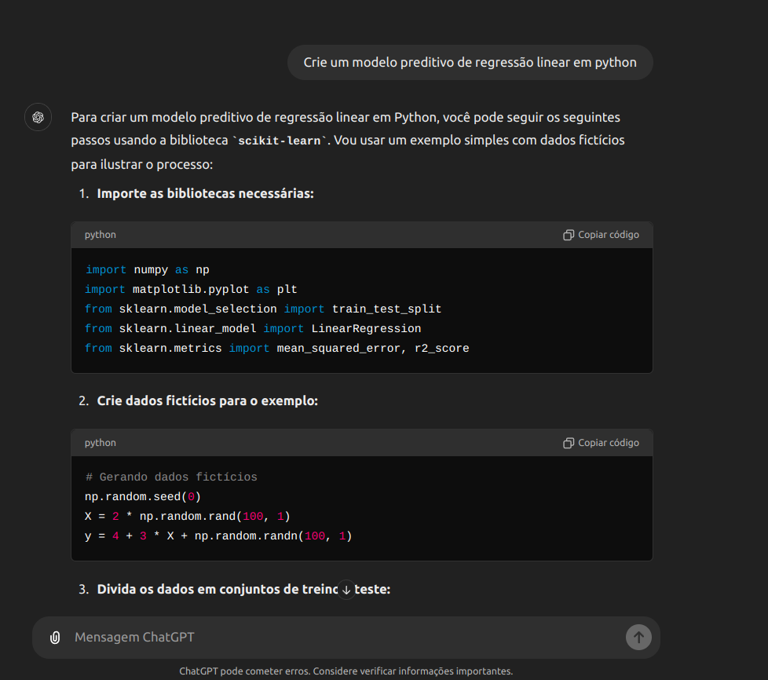

# FASE 3 - IA GENERATIVAS - INTRODUÇÃO A IA GENERATIVA

Estamos vivendo uma nova era da inteligência artificial, e a famosa "Inteligência Artificial Generativa" tem ganhado muita atenção nos últimos tempos devido a sua incrível capacidade de gerar conteúdos de forma inteligente e automatizada. Nesta aula, você vai aprender qual é a “mágica” que acontece por trás dos panos da IA Generativa e quais são os principais tipos existentes no mercado. Vamos lá?

Que tal mergulhar no incrível mundo da IA Generativa? Nas videoaulas, te convidamos a conhecer mais sobre essa tecnologia que tem ganhado a atenção do mundo tech. Vamos conhecer a história e como é o funcionamento da geração de conteúdo utilizando ferramentas práticas de IA disponíveis no mercado! 

## O que é a IA generativa?

**(resposta do ChatGPT)**

Uma IA generativa é um tipo de inteligência artificial projetada para criar novos dados ou conteúdo que seja similar aos dados nos quais foi treinada. Isso inclui a geração de texto, imagens, música, vídeos, e outros tipos de conteúdo. As IA generativas utilizam modelos de aprendizado de máquina, como redes neurais, para aprender padrões a partir de grandes quantidades de dados e, em seguida, gerar novas amostras que seguem esses padrões.

Aqui estão alguns exemplos e aplicações de IA generativa:

Modelos de Linguagem (NLP): Modelos como GPT (Generative Pre-trained Transformer) podem gerar texto coerente e contextual, responder perguntas, criar histórias, entre outras aplicações de processamento de linguagem natural.

Geradores de Imagens: Redes neurais convolucionais, como GANs (Generative Adversarial Networks), podem criar imagens realistas a partir do zero, incluindo rostos humanos, paisagens, e até mesmo arte abstrata.

Música e Áudio: IA generativa pode compor música, criar efeitos sonoros, ou até mesmo imitar a voz humana.

Modelagem 3D: Algoritmos de IA podem gerar modelos tridimensionais para uso em jogos, animações, ou design de produtos.

Síntese de Vídeo: Ferramentas de IA generativa podem criar vídeos a partir de descrições textuais ou transformar vídeos existentes de maneiras criativas.

Os algoritmos generativos frequentemente envolvem técnicas como aprendizado supervisionado e não supervisionado, aprendizado por reforço, e redes adversariais, onde dois modelos (gerador e discriminador) competem para melhorar continuamente a qualidade dos dados gerados.

Se você quiser saber mais sobre uma aplicação específica ou como funciona um tipo específico de IA generativa, estou à disposição para ajudar!

**(resposta do Gemini)**

Inteligência Artificial Generativa: Criando o Novo a partir do Existente
Uma inteligência artificial generativa é como um artista digital extremamente versátil. Em vez de pintar ou esculpir, ela cria textos, imagens, músicas e outros tipos de conteúdo. Mas como ela faz isso?

Imagine treinar uma máquina com milhões de livros, artigos, fotos e músicas. A partir desse vasto conhecimento, ela aprende a identificar padrões, estilos e estruturas. Com essa base, a IA generativa pode:

* Escrever textos criativos: Redigir poemas, roteiros, e-mails, artigos e até mesmo códigos de programação.
* Gerar imagens realistas: Criar obras de arte, logotipos, designs e até mesmo fotos de pessoas que não existem.
* Compor músicas originais: Produzir melodias, harmonias e letras em diferentes estilos musicais.

Mas como isso é útil no dia a dia?

As aplicações são inúmeras e vão desde a criação de conteúdo para marketing e entretenimento até a geração de código para acelerar o desenvolvimento de software. Algumas das áreas onde a IA generativa está fazendo a diferença incluem:

* Design: Criação rápida de protótipos e conceitos visuais.
* Marketing: Produção de conteúdo personalizado e engajador.
* Educação: Criação de materiais didáticos personalizados e interativos.
* Entretenimento: Desenvolvimento de jogos, filmes e animações.
* Em resumo, a inteligência artificial generativa está revolucionando a forma como criamos e consumimos conteúdo. Ela oferece um mundo de possibilidades e está abrindo novas fronteiras para a criatividade humana.

Gostaria de saber mais sobre algum aspecto específico da inteligência artificial generativa? Posso explicar como ela funciona em detalhes, mostrar alguns exemplos práticos ou discutir as implicações éticas dessa tecnologia.

**Algumas perguntas que você pode fazer:**

* Como a IA generativa aprende a criar conteúdo?
* Quais são as principais ferramentas de IA generativa disponíveis?
* Quais são os desafios e riscos da IA generativa?
* Como a IA generativa pode ser usada para o bem da sociedade?
* Fico à disposição para responder suas dúvidas!

## Pedindo para o ChatGPT gerar um código

## Gerando uma imagem com IA

Existem vários sites que permitem gerar imagens com IA, o exemplo a seguir foi gerado pela ia da plataforma **[canva.com](canva.com)**.

## Evolução a IA generativa

(Rede GANs - Rede Generativas) - Imagem

## Aplicações da IA generativa

