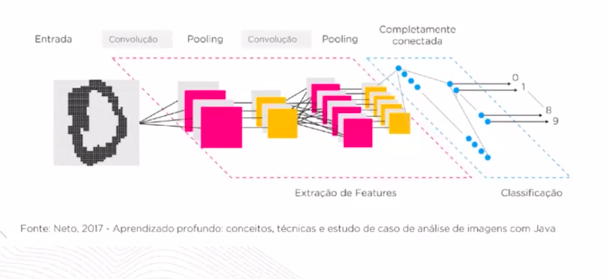

# FASE 3 - IA GENERATIVAS - FUNDAMENTOS DA IA GENERATIVA

A natureza inspirou muitas criações para os seres humanos, tais como as aves nos inspiraram a voar com os aviões, a planta bardana inspirou a criação do velcro e o cérebro humano inspirou a criação das chamadas “Redes Neurais Artificiais” (RNA), consideradas como aprendizado profundo. As redes neurais artificiais são poderosas e escaláveis, sendo muito utilizadas para lidar com grandes tarefas altamente complexas do aprendizado de máquina, tais como classificação de imagens, reconhecimento de fala, criação de imagens, chats poderosos e até mesmo o aprendizado de jogar videogames.

Para aprender sobre IA generativa, é preciso conhecer muito bem os fundamentos de deep learning e processamento de linguagem natural. Conhecer os fundamentos possibilita compreender como os modelos generativos são criados e como chegamos nessa evolução. Nesta aula, você vai aprender sobre as principais técnicas que possibilitaram a evolução desses modelos. Vamos lá? 

Que tal aprender na prática como funciona um modelo de deep learning? Nessas aulas, você vai aprender na prática com o python como funcionam os embeddings e as deep learnings.

## Entendendo a motivação

**Motivação Biológica**

## Redes neurais - multilayer perceptron

**Critérios de parada da rede:**

**Epochs:** São o total de vezes que são executadas as redes neurais. (Número máximo de épocas). 
**Batch:** Conjunto de instâncias de rede neural (número de exemplos de treinamento utilizados). Valor limite à **taxa de erro mínima** previamente estabelecida.

## Funcionamento matemático

## Funções de ativações

O objetivo de uma função de ativação é realizar a **transformação não linear** dos neurônios, aliás uma rede neural sem a função de ativação é essencialmente um modelo de regressão linear.

A função de ativação permite que as mudanças realizadas nos pesos e bias causam uma alteração na saída final do modelo (output).

### Sigmóide

### Tangente hiperbólica (tanh)

### ReLU (unidade linear retificada)

### Leaky ReLU

### Softmax

## Gradiente descendente

A descida do gradiente é um algoritmo de otimização para encontrar os valores de parâmetros (pesos) de uma função que minimizar uma função de custo.

Pensando na questão de matemática por trás dos gradientes, podemos dizer que o gradiente descendente é a **derivada da função do erro** em relação a nosso peso.

## Taxa de aprendizagem

Taxa de aprendizagem controla o tamanho do passo em cada iteração.

## Tipos de gradiente

**Momentum:** O Momentum é uma técnica que visa melhorar o desempenho do Gradiente Descendente, adicionando um componente de inércia ao algoritmo. Isso significa que as atualizações dos parâmetros consideram não apenas o gradiente atual, mas também as atualizações anteriores.

**AdaGrad (Adaptive Gradient):** O AdaGrad é um algoritmo que ajusta automaticamente o passo de aprendizagem para cada parâmetro do modelo. Isso significa que os parâmetros com gradientes mais suaves recebem passos de aprendizagem menores, enquanto os parâmetros com gradientes mais acentuados recebem passos maiores.

**Adaptative moment estimation (Adam):** Combina as ideia do Momentum e do RMSProp: assim como a otimização de momentum, o Adam acompanha uma média exponencialmente decadente de gradientes passados, e assim como o RMSProp, controla um média exponencialmente decadente de gradiente quadrados passados.

O otimizador Adam requer menos configurações de hiperparâmetros da taxa de aprendizagem, então um valor padrão n=0,001 pode ser uma boa opção.

## REDES NEURAIS CONVOLUCIONAIS (CNN)

### Entendendo a motivação

As CNNs também são inspiradas em fatores biológicos. Em 1958 e 1959, David H. Hubel e Token Wiesel realizaram uma série de experimentos com gatos, na qual proporcionaram o aprendizado sobre a estrutura do córtex visual.

### Como o computador entende imagens?

### Arquitetura das CNNs

**Entrada:** A entrada basicamente recebe uma imagem.

**Convolução:** "Detector de atributos", essa etapa vai mapear a região de uma imagem para posteriormente termos um "mapa de atributos" (feature map). Funciona basicamente como um filtro (kernel).

O filtro nada mais é do que a multiplicação de matrizes. Esse processo é realizado diversas vezes por toda a imagem recebida. Nessa etapa temos um multiplicador que se chama "**stride (deslocamento)**" (normalmente com valor = 1) cuja a principal função é realizar a transformação da imagem.

Toda essa transformação irá resultar uma imagem com uma dimensionalidade menor.

Funcionamento da stride:

Funcionamento do filtro:

Muitas convoluções podem impactar na assertividade da CNN se o tamanho da imagem for muito reduzido. Para contornar esse cenário, normalmente é utilizado o conceito de **Padding** (distância entre o conteúdo de um elemento e suas bordas).

O objetivo do padding é manter a dimensionalidade da imagem.

Etapas da convolução:

A cada medida que realizamos essas extrações de características das imagens, vamos adicionando novos mapas de filtros: Exemplo: 6 filtros de 5x5 teríamos 6 mapas de ativação.

Entre as camadas de mapa de atributos, vamos ter uma **função de ativação** para realizar a classificação das imagens.

Então nossa rede se torna uma sequência de camadas de convolução, intercaladas por funções de ativação.

**Pooling:** Processo de redução de dimensionalidade da imagem. A principal motivação dessa operação no modelo, é de diminuir sua variância a pequenas alterações e também de reduzir a quantidade de parâmetros treinados pela rede.

A operação max pooling retira o maior (max) elemento de determinada região da matriz. Em seguida é realizada um novo calculo de stride (assim como na convolução).

## Redes Neurais Recorrentes

### Entendendo a motivação

Podemos definir as redes neurais recorrentes como uma rede que trabalha com **sequências de comprimento arbitrários, ou seja, dados que dependem de sequências anteriores à sua tarefa atual**, tal como as séries temporais ou textos que dependem de palavras anteriores para fazer sentido (trazer o contexto). Uma rede neural recorrente é muito parecida com as redes neurais feedforward, exceto pelo fato de obter conexões de neurônios que apontam para trás, podemos dizer que essa rede é nostágica!

### Entendendo as RNNs

Existe a seguinte frase:

* Segue documento em **anexo.**

Para conseguir prever a palavra **anexo** precisamos colocar as palavras **segue** e **documento** em uma rede neural recorrente para conseguir prever a palavra **anexo**.

Existe a seguinte frase:

* O tempo que passei na China foi muito legal e tive a oportunidade de aprender a falar **chinês**, um idioma incrível.

Neste exemeplo precisamos adivinhar a palavra **chinês**, porém precimos compreender todo o contexto antes. Só que nesse caso o número de palavras (ou de tokens) é muito maior, dificultando a previsão. Nesse caso as **redes neurais recorrentes** podem ter dificuldades na previsão e apresentar o problema chamado **Vanish Gradient Problem**.

### Vanish Gradient Problem

O gap entre a informação relevante (início da frase) e o ponto onde ela é requisitada (fim da frase, palavra "chinês") pode se tornar bem grande. Infelizmente, conforme esse gap aumenta de tamanho, as redes neurais recorrentes comuns se tornam incapazes de aprender a conectar as informações. O que acontece na verdade é que elas sofrem do chamado **vanish gradient problem**. 
 

### Soluções: Vanish Gradient Problem

Para sulocionar esse tipo de deficiência das RNNs tradicionais, temos redes recorrentes mais evoluídas, tal como as redes neural **LSTM** **Long Short Term Memory** (memória de curto e longo prazo) e os modelos **Transformers**.

### LSTM - Long Short Term Memory

O que diferencia as redes LSTM das outras RNNs é sua capacidade de armazenar informações por longos perídos de tempo. Elas possuem uma **célula de memória** especial que controla o fluxo de informações através da rede, permitindo que ela aprenda dependências de longo alcanse em dados sequenciais.

## Embeddings

### Entendendo os tokens

**Stemização:** Imagine um explorador desbravando uma floresta densa. A stemização é como um machete afiado, cortando galhos e folhas (afixos) para chegar ao tronco principal (radical) da palavra de forma rápida e eficiente. Ela **remove sufixos e prefixos comuns, mas nem sempre se preocupa com a precisão gramatival**.

**Lemitização:** Agora, imagine um estudioso meticuloso meapeando cada árvore da floresta. A lematização é como um mapa detalhado, guiando-nos à forma canônica da palavra, levando em consideração o contexto e a gramática. Ela consulta dicionários e regras linguísticas para encontrar a forma correta, mesmo que seja menos comum no dia a dia.

Podemos definir a técnica de word embeddings como a transformação de palavras em arrays (vetores).

Calculo da distâncias entre as palavras:

