# FASE 3 - IA GENERATIVAS - O USO DE IAS GENERATIVAS NA GERAÇÃO DE CÓDIGOS, IMAGENS E VÍDEOS

Você sabia que as IAs generativas podem ser utilizadas para a geração de códigos, imagens e até vídeos? Pois é, incrível não é mesmo? Imagine as possibilidades para a geração de conteúdo  e a produtividade que pode gerar em nosso dia a dia?! Nesta aula, você vai aprender como é o funcionamento dessas tecnologias e como podemos utilizá-las de forma produtiva.

Nas videoaulas você aprenderá como as IA generativas funcionam por trás da “mágica” para criar imagens, textos e vídeos. Você vai aprender tanto a teoria, como a prática desses modelos geradores de conteúdo.

# Entendendo a criação de imagens

## GANS

Redes Adversárias Generativas, também podendo ser encontradas em literaturas por **Difusão**. O nome difusão não existe à toa, essa rede consegue criar imagens novas com a "disputa" entre duas redes: uma **rede geradora** responsável por tentar gerar novos dados (novas imagens) e uma **rede discriminadora** que irá tentar distinguir imagens reais.

## Funcionamento

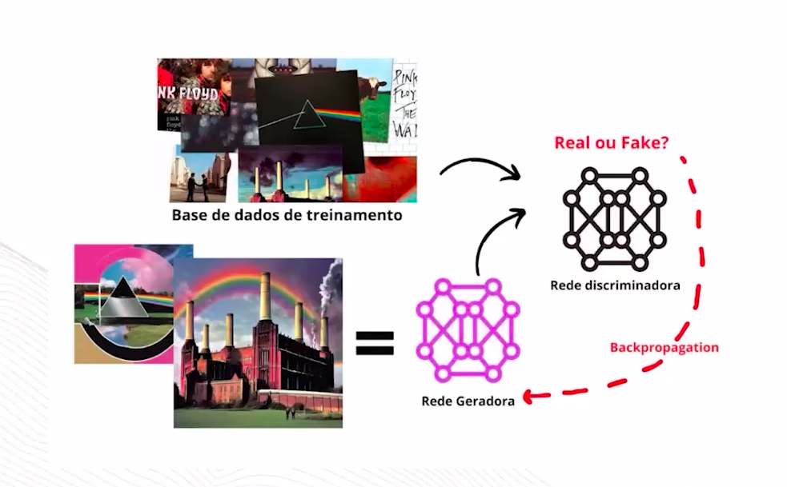

## Arquitetura

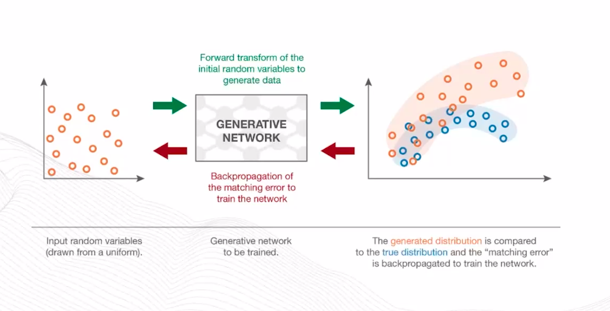

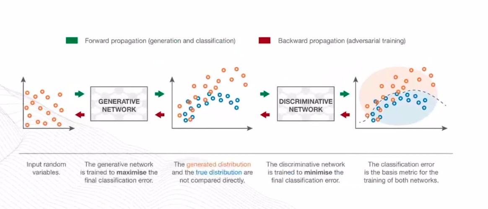

# Entendendo a crição de vídeos

## Redes GANs

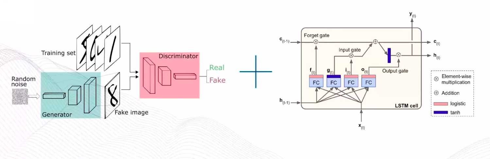

### LSTM em mais detalhes

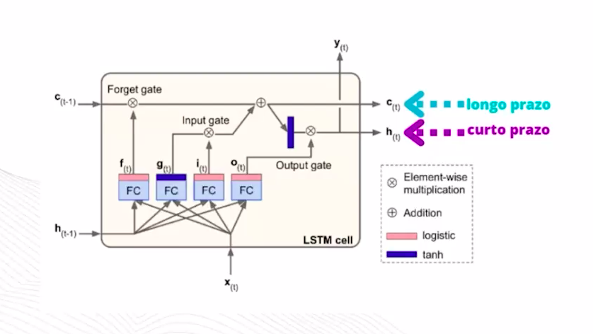

Como o estado de longo prazo **ct** atravessa a rede da esquerda para a direita, podemos observar um primeiro portão de entrada dos dados que seria o **forget gate**.

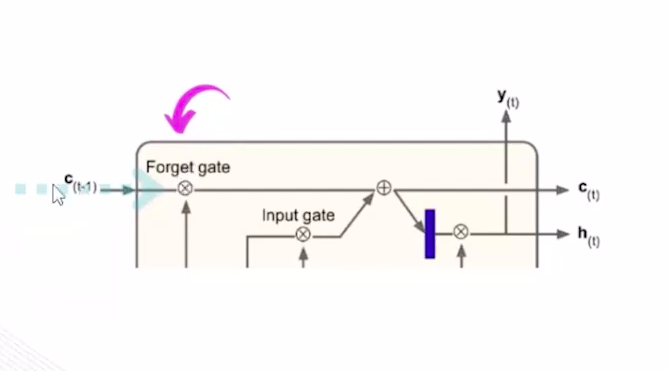

O forget gate é responsável por descartar algumas memórias e adicionar algumas novas memórias ao longo de adições de memórias que vem do **input gate**.

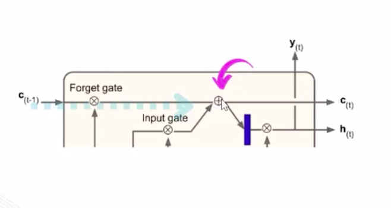

Logo após a operação de adição, o estado de longo prazo é copiado e passado pela **função de ativação tangente hiperbólica (tanh)** e seguida seu resultado é filtrado pelo **output gate**, produzindo o estado de curto prazo em ht.  

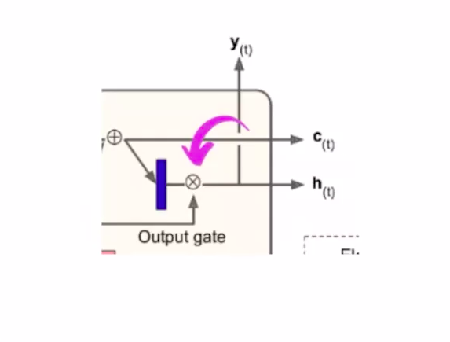

O vetor de entrada atual **xt** e o estado de curto prazo anterior **h(t-1)** são fornecidos para quatro camadas diferentes conectadas. A camada que produz g(t) assume o papel de analisar as entradas atuais em x(t) e o estado anterior de curto prazo h(t-1). A saída dessa célula basicamente vai para y(t) e h(t).

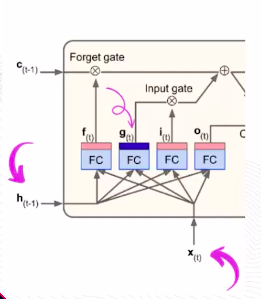

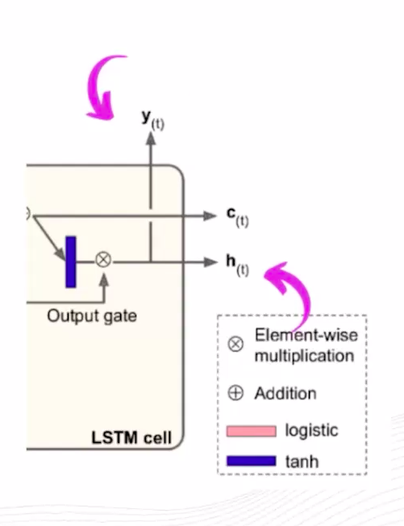

As outras três camadas (forget gate, input gate e output gate) são os chamados gates controllers. Esses portões utilizam funções de ativação logística que variam de 0 a 1.

* **Forget gate (ft):** Decide quais partes do cell state continuam importantes (exclui as partes que devem ser apagadas).
* **Input gate (it):** Decide quais informações da memória de curto prazo devem ser adicionadas ao cell state (célula de lona memória).
* **Output gate (ot):** Decide quais partes do cell state são importantes no instante atual para gerar o output. 

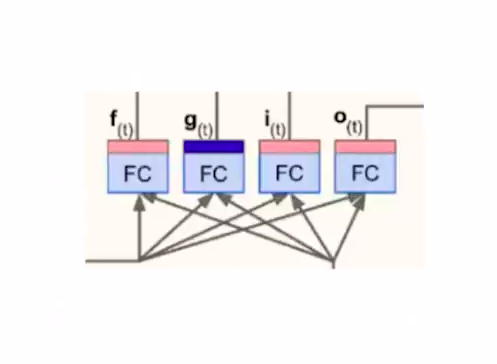
