# FASE 3 - IA GENERATIVAS - UTLIZANDO O CHATGPT PARA GERAÇÃO DE CÓDIGOS

Utilizando o ChatGPT para criação de um modelo classificação. O objetivo é fazer as perguntas certas (ou prompts eficiêntes) para agilizar a criação do modelo. Ao já conhecer o processo de criação de um modelo preditivo isso facilita a criação de prompts para geração de códigos.

## Crição de um modelo de classificação

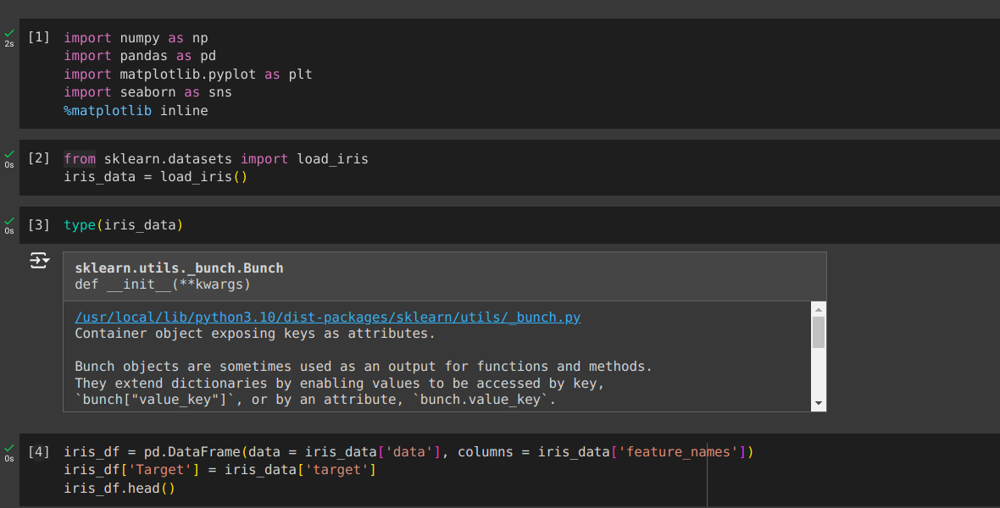
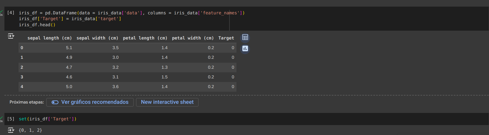

### Etapas

Ao saber o que já fazer, podemos criar etapas para facilitar a criação dos prompts.

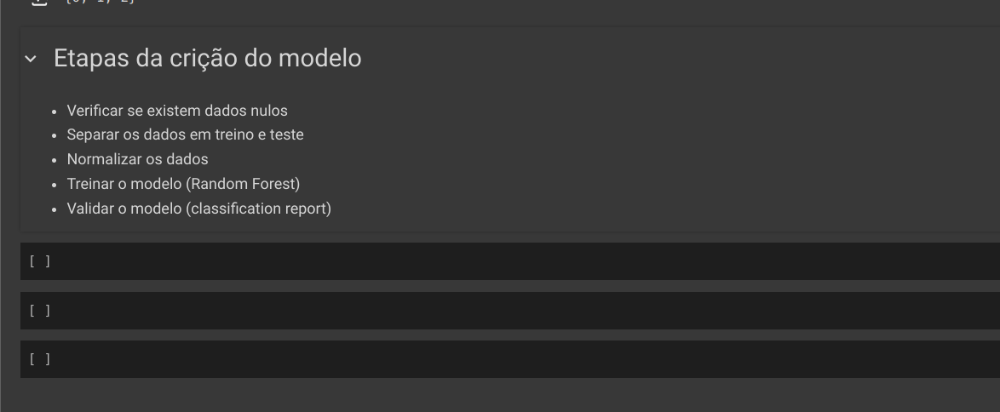

* **Checar se existem dados nulos**: Ao perguntar de existem dados nulos ele irá responder já com um código de exemplo em python e com uma breve explicação. Ele respondeu dessa maneira por causa das palvras chaves **dataframe, iris_df** que são palavras muito utilizadas no estudos de datascience.

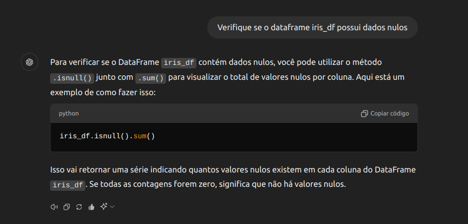
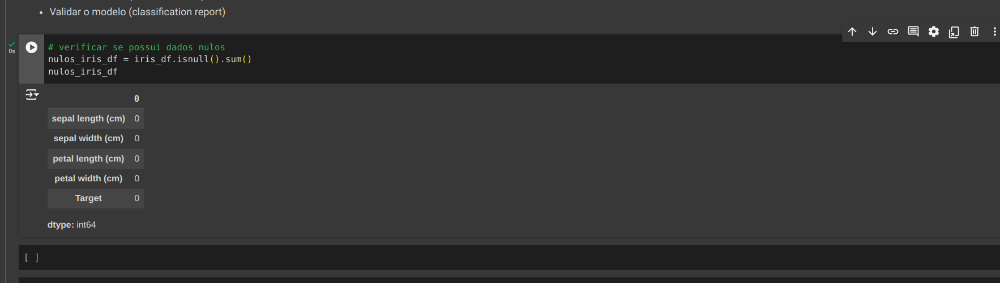

* **Separando os dados em treino e teste**: É possível que ao fazer perguntas simples ao ChatGPT ele gere uma resposta simples ou incompleta. Para ter uma resposta mais completa tente colocar palavras chaves ou termos já ditos em prompts anteriores.

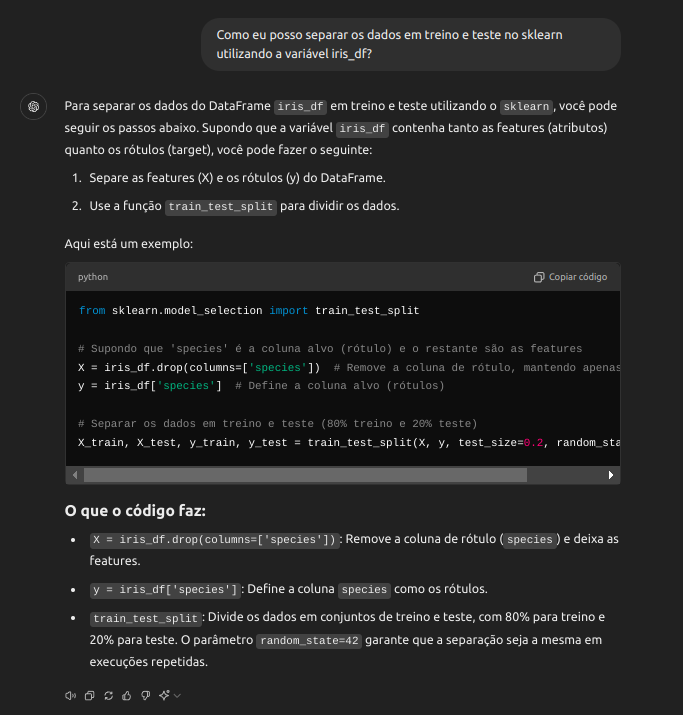
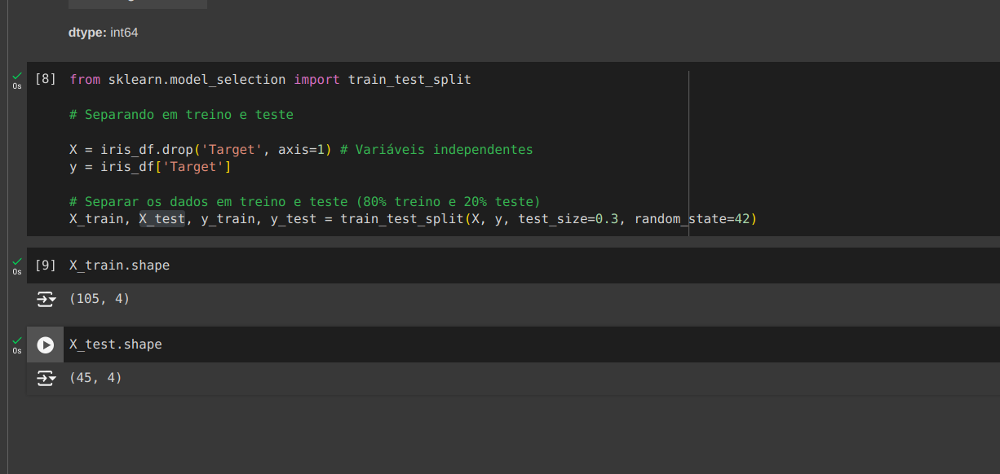

* **Normalização dos dados**: É importante ao fazer prompts utilizar certos termos para ter a resposta mais próxima do desejado, por exemplo, ao fazer a pergunta "*Normalize os dados de treino e teste*" o ChatGPT retornou uma resposta utlizando o **StandardScaler**. Nesse exemplo de modelo o ideal seria utilizar o **MinMaxScaler**. Para conseguir a resposta mais próxima do desejado podemos perguntar o seguinte "*Eu quero a normalização entre 0 e 1*", onde o termo **0 e 1** se refere ao **MinMaxScaler**.

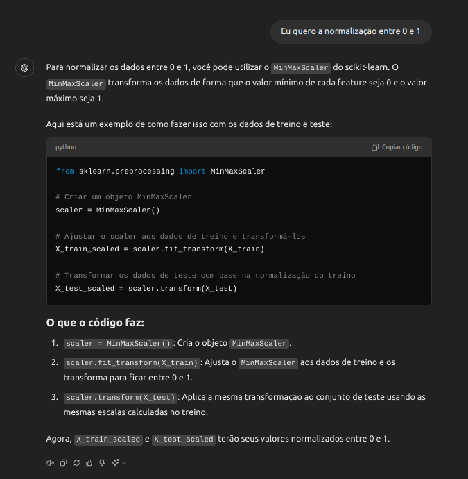

* **Treinando o modelo**: O ChatGTP entende o contexto das perguntas já feitas, isso ajuda a melhorar as próximas respotas. Por exemplo, ao pedir o Chat gerar um código de treinamento de modelo o código gerado resultava em um **overfiting**. Podemos mencionar o **overfiting** ou algum otro termo e pedir para melhorar o código.

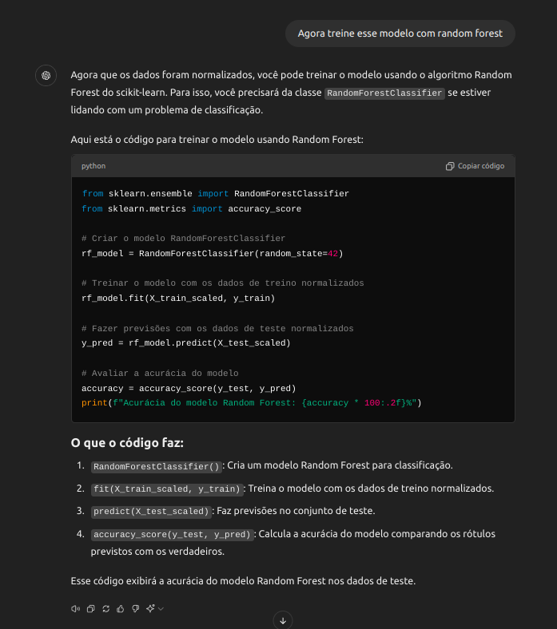
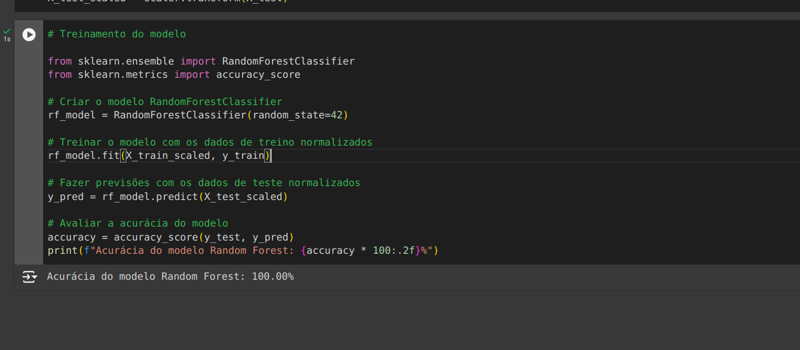
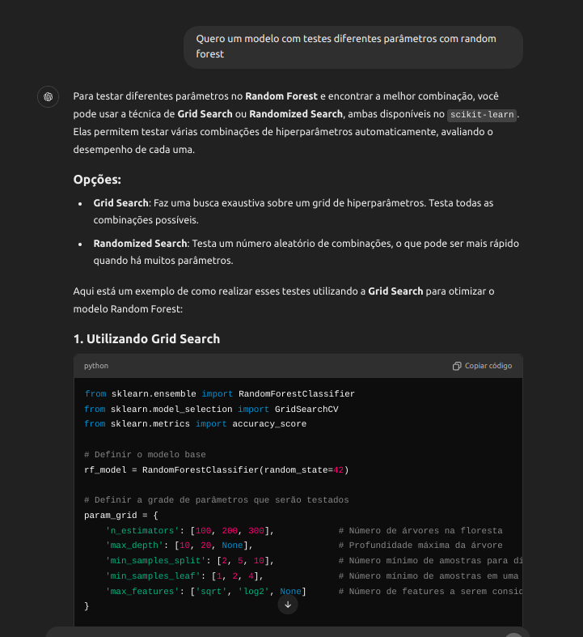
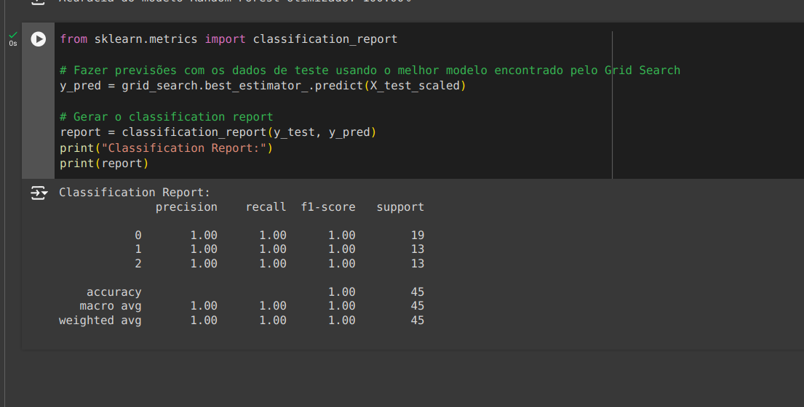
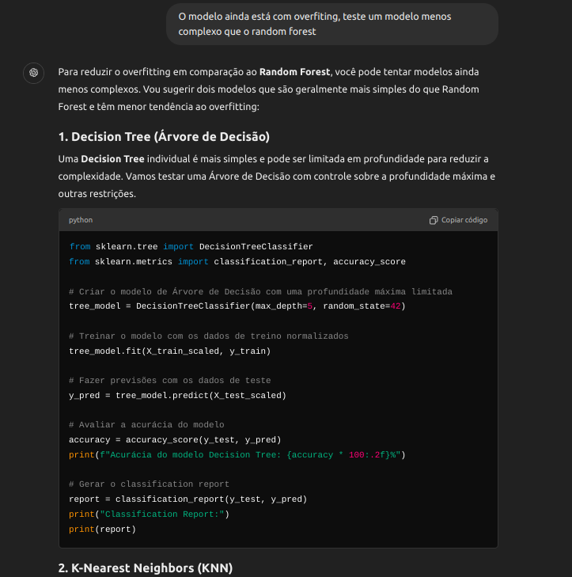
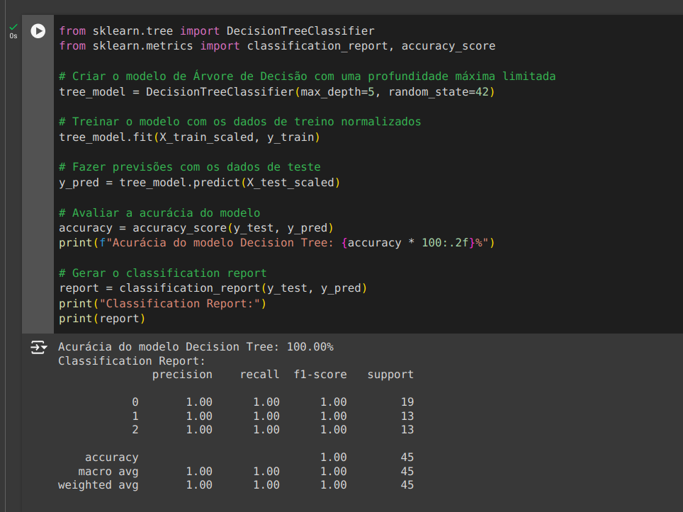

## Conclusão

O objetivo não é utilizar a IA para gerar todo código, pois ela erra muito. O ideal é saber o que deve ser feito e fazer as perguntas certas para gerar códigos ou estruturas para auxilar o trabalho e sem esquecer que também podemos pegar as respostas e alterar nós mesmo os parâmetros.

