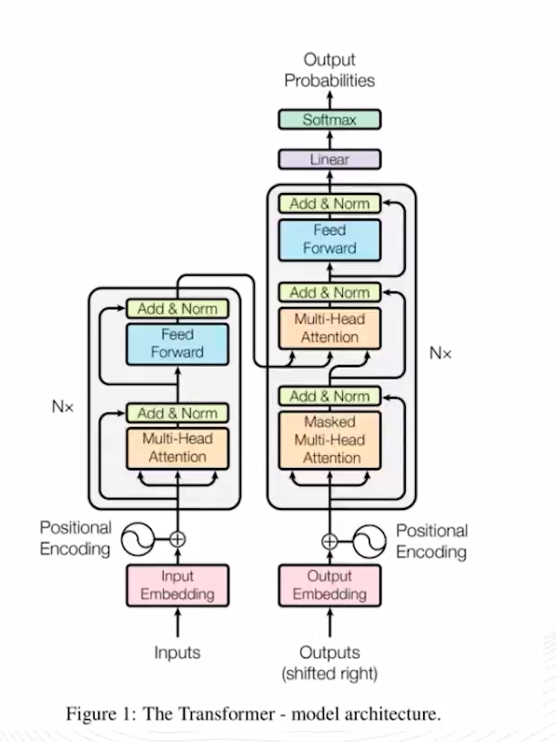
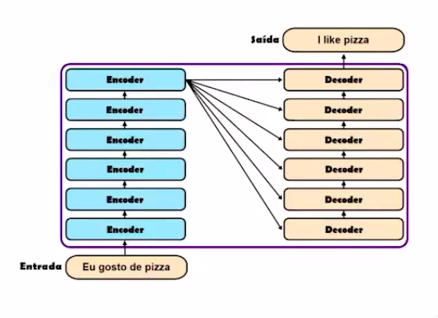
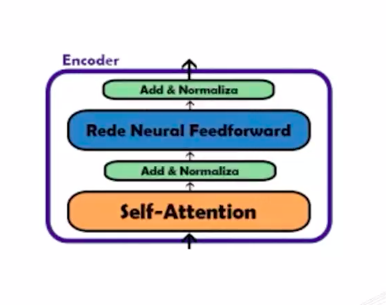
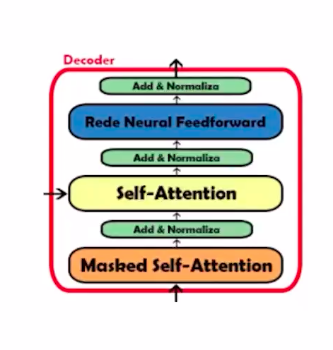
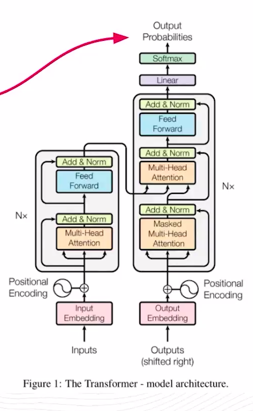
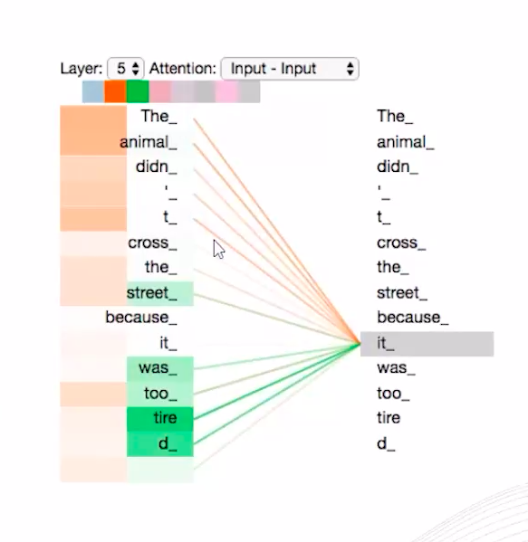

# FASE 3 - IA GENERATIVAS - PROJETOS PRÁTICOS COM A IA GENERATIVA

Chegou o momento de colocar em prática todo o aprendizado que tivemos nas aulas anteriores e realizar um projeto prático para você entender como podemos desenvolver um IA generativa do zero. Vamos lá? 

Nesta aula, vamos conhecer como os modelos “Transformers geram conteúdos” e as “limitações das RNN tradicionais”. Também criaremos um projeto do zero utilizando a IA generativa da Google com o Gemini. Nosso objetivo será criar um cardápio fitness utilizando a união de um modelo generativo do gemini com um documento existente treinado por embeddings. Essa técnica é denominada “RAG” (Retrieval Augmented Generation).
            
## Modelo Transformers

Como já mencionamos na aula de introdução, os modelos transformers utilizam o mecanismo de atenção (Attention Mechanism), apresentado pelo Google em 2017. Por trás da magia desse modelo de atenção, **inicialmente temos os compenentes de codificação e decodificação trabalhando entre si para buscar as relações entre as palavras**. 

### Funcionamento

O artigo original empilha seis camadas de cada um deles, mas esse valor pode ser alterado caso seja necessário.

**Encoder (codificação)**: Essa parte da arquitetura da rede analisa casa palavra de entrada **encontrando suas relações semânticas em conjunto com uma camada de embeddings**.

Depois de encontrar os embeddings correspondentes nessa etapa, esses tokens são atributos a uma camada de rede de "Multi-Head Attention" (ajuda o enconder a examinar as outras palavras da frase enquanto cofica uma palavra específica) e seguida a saída vai para uma camada de "Feed Forward" para alimentar a camada de decoder que também possui uma camada "Feed Forward".

**Decoder (decodificação)**: A camada de decoder possui as mesmas camadas da encoder, porém com uma diferença: a camada intermediária self-attention, que recebe diretamente o resultado da camada de encoders, com o objetivo de foco de atenção nas partes mais importantes da frase de entrada (é o método incorpora o "entendimento" de outras palavras relevantes na palavra que estamos processamento no momento).

Essa camada self-attention só consegue focar nas palavras anteriores a etapa atual, por isso também é chamada de "masked" (camuflada). Essa etapa utiliza um embedding para capturar qual é a palavra que faz mais sentido ser retornada no prompt de geração de conteúdo com base no seu maior potencial de probabilidade para gerar o output.

Depois na camada de saída final das palavras selecionadas pelo decoder, será realizada uma **transformação linear** aos vetores de saída de todas as subcamdas de atenção do decoder para gerar uma saída de um vocabulário.

Essa transformação visa combinar as informações de diferentes subcamadas, capturando uma representação mais abrangente do significando de entrada e do contexto da geração. Após a transformação linear, a **a função softmax** entra em cena. Ela aplica uma função de normalização aos vetores de saída, garantindo que os velores fiquem entre 0 e 1 e que a soma de todos os valores seja 1.

### Multi-Head Attention

Em vez de focar apenas em uma palavra por vez, a **Multi-Head Self Attention** divide a atenção em **múltiplas "cabeças"**.

Cada "cabeça" se concentra em um aspecto diferente da relação entre as palavras, como proximidade, similaridade gramatical ou significado semântico. As informações de todas as "cabeças" são então combinadas para criar uma represntação mais rica e completa do siginificado da frase. Observe a imagem a seguir, é como se cada cor que está sendo mapeada por cada palavra, representasse uma "cabeça" diferente com diferentes contextos.

