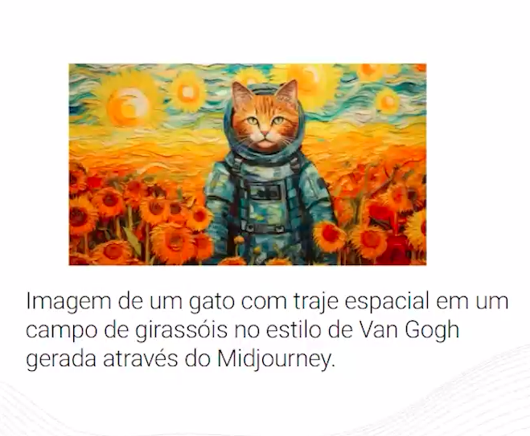

# FASE 3 - IA GENERATIVAS - OS DESAFIOS ÉTICOS IAS GENERATIVAS NA CRIAÇÃO DE CONTEÚDO

Ao mesmo tempo em que as IA generativas trouxeram uma grande revolução para a área de inteligência artificial, elas também trouxeram muita discussão a respeito da privacidade e segurança dos dados. Nesta aula, vamos discutir sobre os desafios éticos da IA generativa na criação de conteúdo.

Nesta videoaula, vamos discutir sobre os desafios da IA generativa a respeito das questões de segurança, privacidade e direitos autorais.

## Direitos autorais

Mais uma polêmica que se popularizou na mídia é a criação de imagens a partir de prompts de textos como é realizado nas ferrametas do Midjourney, o DALL-E e o Stable Diffusion. A criação de imagens extramamente realistas traz um certo desconforto, além da possibilidade de criação de imagens com algum estilo existente de artistas. Veja alguns exemplos gerados pelo Midjourney.

## Fake News

Um estudo feito pela página NewsGuard em 2023 detectou 50 sites de notícias que estavam publicando diariamente centenas de artigos gerados pela intetligência artificial generativa com intuito de ganhar dinheiro com propagandas. Um desses sites tinha afirmado por exemplo que o presidente dos Estados Unidos, Joe Biden, teria falecido em abril 2023 e que o vice-presidente teria assumido a presidência em seu lugar. No Brasil, a página Ohar Digital noticiou que esses modelos estão sendo utilizados por bandidos para criar golpes com textos mais elaborados. Em 2023 a mídia ficou impactada com a foto do Papa Francisco utilizando uma blusa no Estilo Puffer e foi compartilhada em sites famosos como o Vouge Brasil, mas a verdade mesmo é que essa foto foi gerada pela inteligência artificial generativa do Modjourney.

## O uso da IA generativa com consiência

### Vieses

Como todo modelo de aprendizado de máquina obtém sua qualidade devido aos dados que são treinados os modelos, com as IAs generativas não funciona diferente. O que vamos precisar tomar cuidado é como vamos utilizar os dados para alimentar esses modelos e além de toda a questão comentada anteriormente de privacidade, segurança e direitos autorais, também devemos nos atentar com os **vieses**.

Existem muitos exemplos na história de modelos preconceituosos como por exemplo o caso ocorrido em 2020 na Universidade de Duke nos Estados Unidos quando lançaram um modelo de IA para melhorar a resolução de imagens de fotos e um usuário do Twitter inseriu uma foto de baixa qualidade do ex-presisente Barack Obama nesse modelo e o mesmo recriou a imagem com uma resolução melhorada, mas que mostrava um homem branco de olhos claros.
