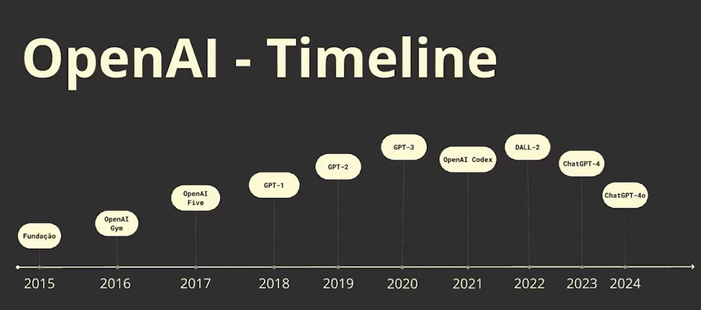
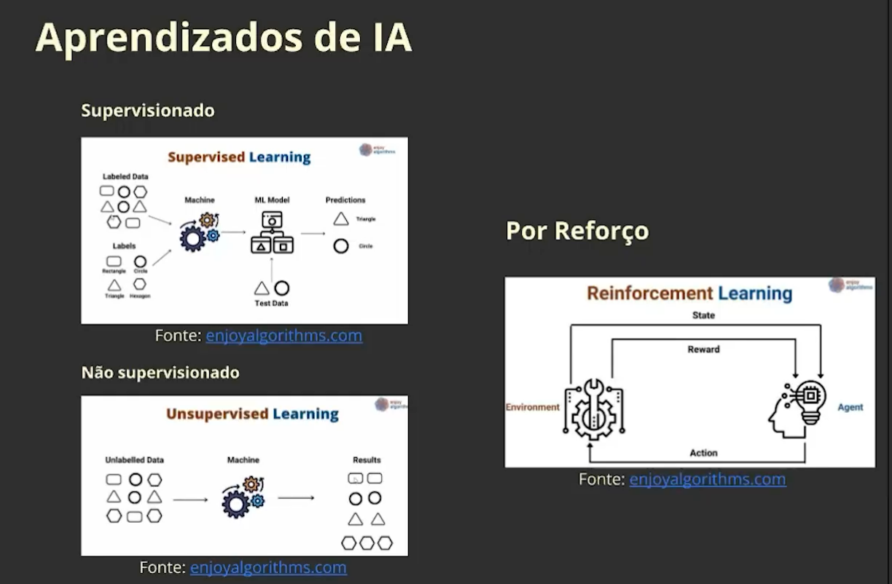
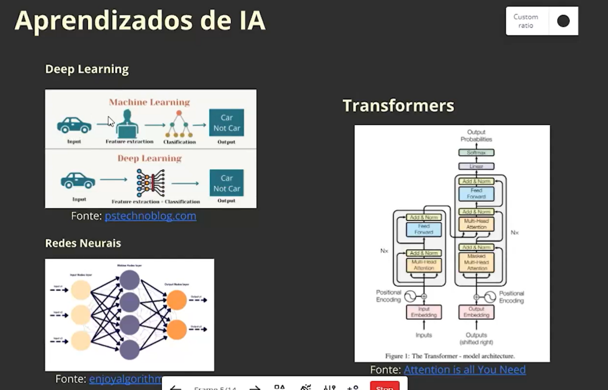
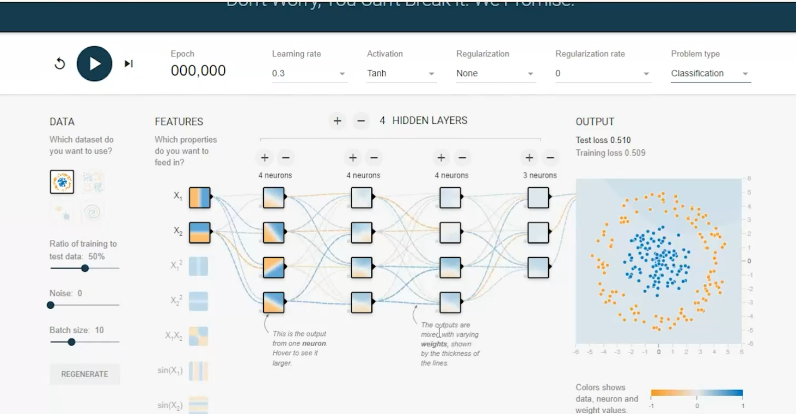
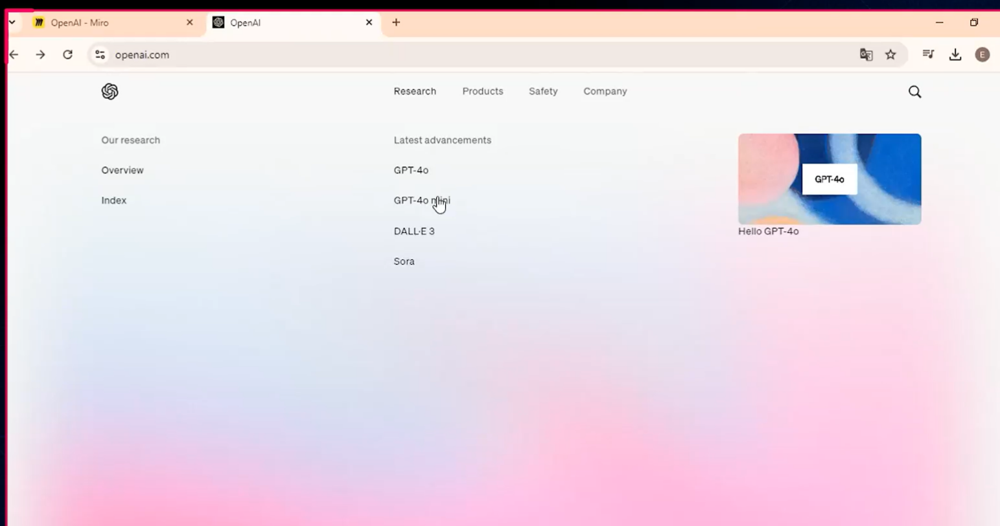

# FASE 4 - OPEN IA - INTRODUÇÃO À OPEN IA E INTELIGÊNCIA ARTIFICIAL

Nesta aula, vamos iniciar nossa jornada pelas possibilidades que a API da OpenAI pode proporcionar nos mais diversos casos, desde geração de textos e imagens, até a conversão de texto em áudio e vice versa. Mas antes, precisamos entender as bases da Inteligência Artificial Generativa e as origens da OpenAI, bem como a sua missão e os produtos que são disponibilizados ao público.
            
Ao longo da disciplina, aprofundaremos as APIs principais e demonstraremos como incorporar essas ferramentas em fluxos de trabalho e nas tarefas do dia a dia.

Neste momento, vamos apenas nos dedicar a compreender os conceitos básicos envolvendo Inteligência Artificial: conheceremos melhor a história da OpenAI e os seus produtos (os quais vamos conhecer melhor ao longo desta disciplina).  Então, continue acompanhando este material e siga para a próxima aula, onde iniciaremos nossa prática com códigos simples para testar e praticar o uso das APIs disponíveis. Boa leitura! 

---

## História da Open IA

## Aprendizados de IA

()

## Site Open IA

