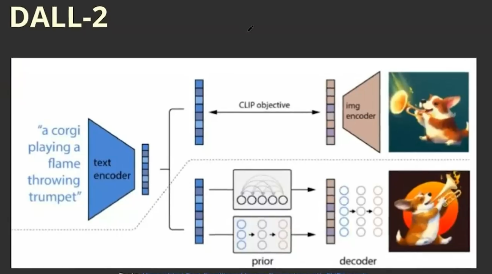

# FASE 4 - OPEN IA - FUNDAMENTOS DA API DO OPENIA

Já sabemos o que é a OpenAI, qual sua missão e produtos, agora vamos ver na prática quais são as APIs (Application Programming Interfaces) disponíveis para utilizarmos em nossos projetos, compreender o que é o GPT e porquê essa tecnologia revolucionou o mundo da Inteligência Artificial e mais especificamente a área de LLMs (Large Language Models). 
            
Vamos, então, ver na prática como funciona cada API dos modelos da OpenAI: Antes de assistir aos vídeos da aula, você deverá criar sua conta na plataforma da OpenAI e instalar a biblioteca para ter acesso aos modelos (nesse curso vamos usar a linguagem Python), então, execute o seguinte comando em seu terminal ou em uma célula de seu Jupyter Notebook:

```sh
pip install openai
```

Com a biblioteca instalada e sua conta criada, realize o login e vá até “Projects”, crie um projeto em “Create project” e dê o nome “fiap-open-ai”. Com isso, podemos organizar melhor nossos usos das APIs e segregar chaves de acesso para projetos diferentes.
            


Pronto! Você já está com o ambiente configurado para começar a sua jornada de aprendizado das APIs da OpenAI. Agora, assista aos vídeos e retorne para saber mais sobre os temas abordados em aula. 
            
## GPT - Generative Pre-Trained Transformers


## DALL-E - Zero-Shot Text-to-Image Generation




## APIs da OpenIA

1. logar na plataforma da OpenIA: https://openai.com/

2. Ir em Products -> API Login

3. Criar um projeto

4. Ir para Dashboard e criar uma API Key (OBS: não esquecer de salvar o secret.)

5. Para usar a API é preciso carregar os créditos. Não precisa ser muito, uns 5 dólares já é o suficiente. (OBS: Existe o usa grátis, porém é limitado.)

