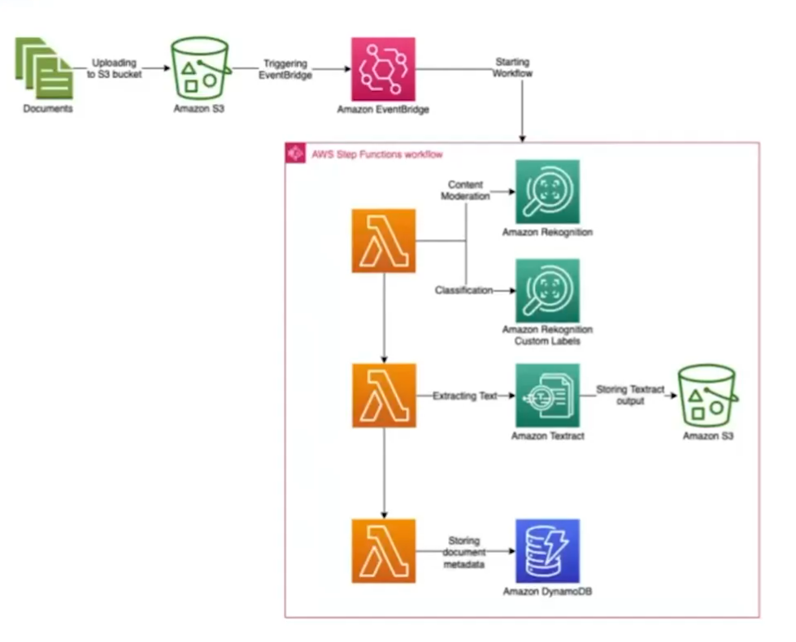
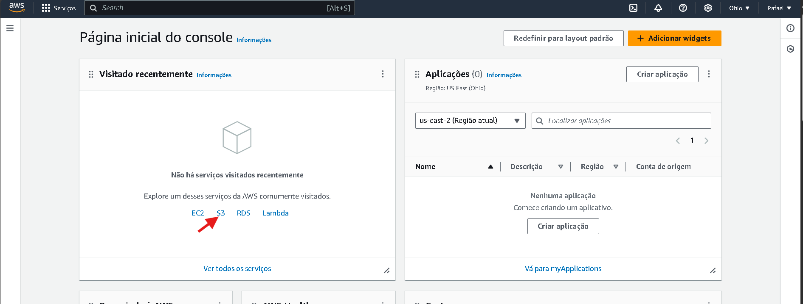
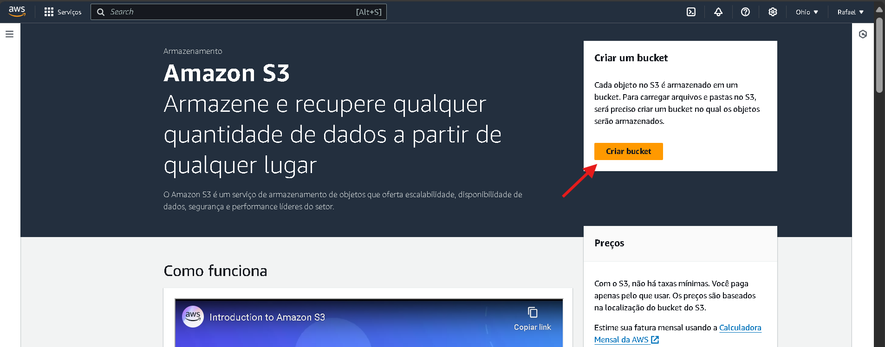
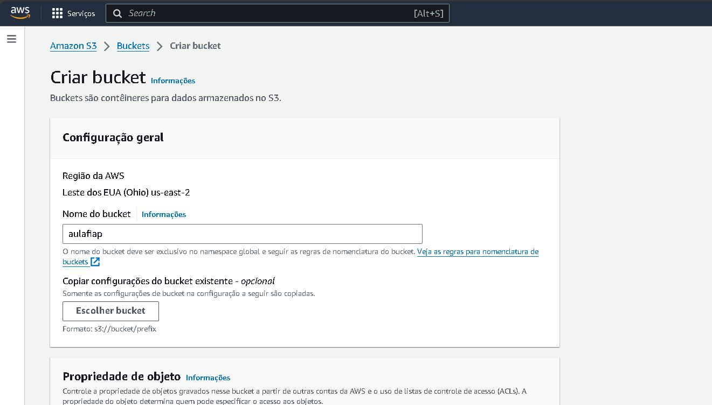
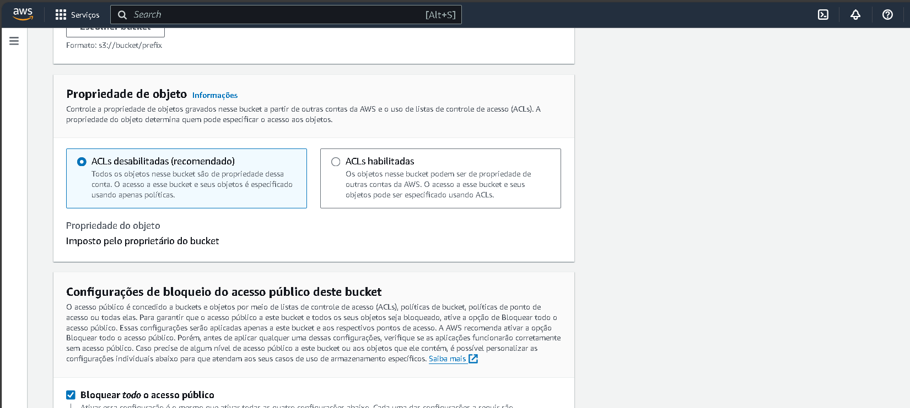
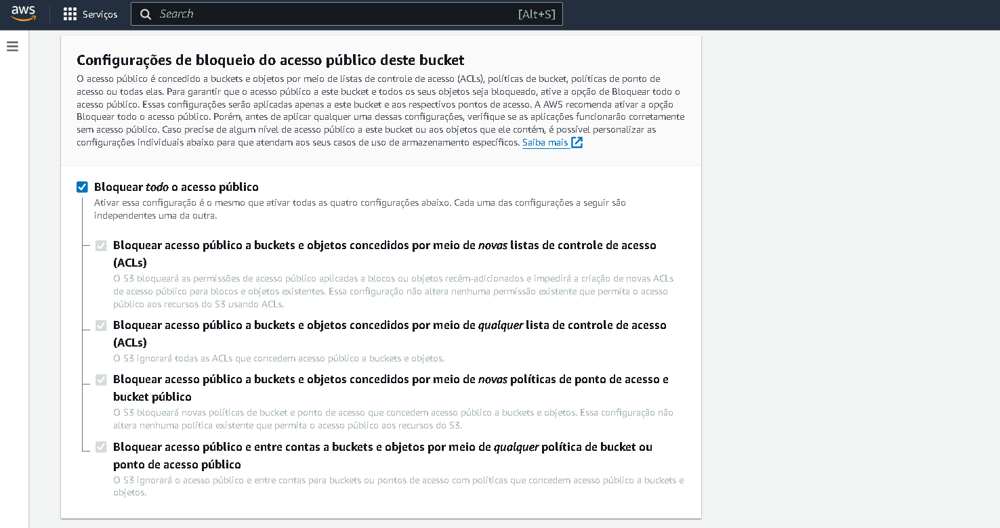
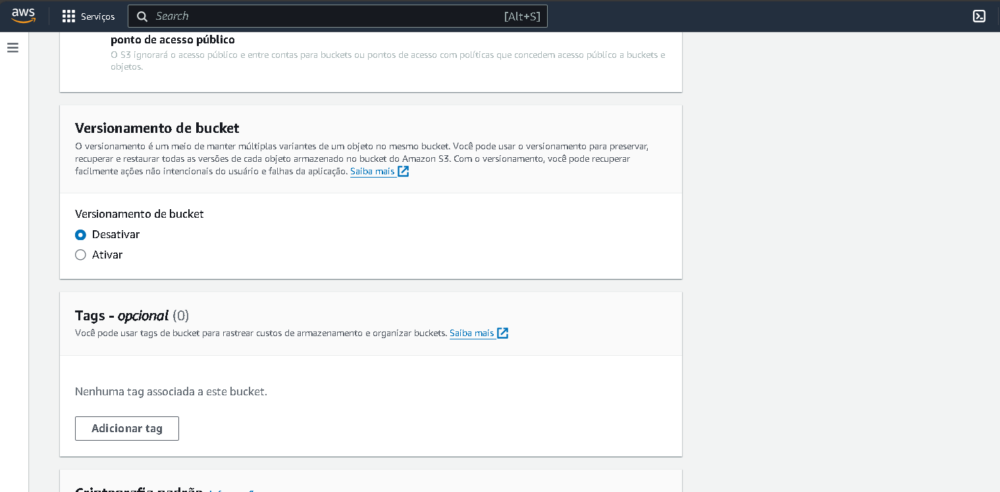
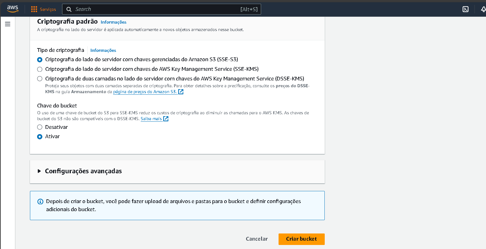
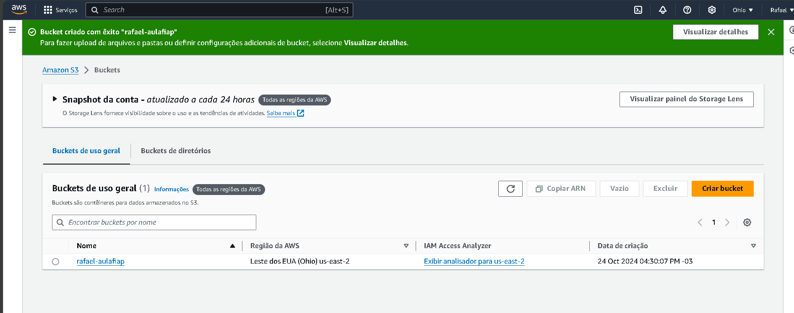
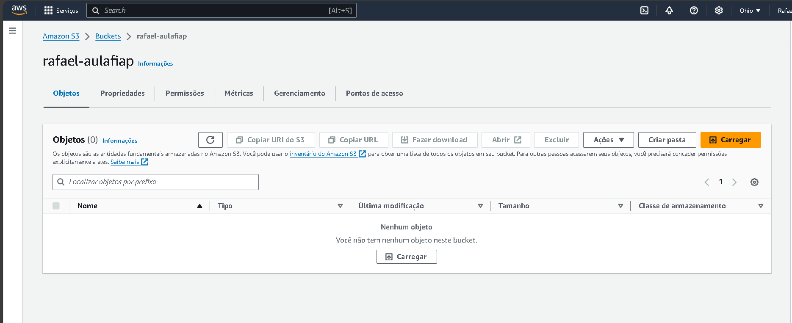

# FASE 4 - TEXTRACT + AWS-COMPREHEND - INTRODUÇÃO AO TEXTRACT E AWS COMPREHEND

Nesta aula, aprenderemos como o Amazon Textract pode ser útil para as empresas no dia a dia, por meio da extração de textos, dados e informações estruturadas de documentos digitalizados, e como o AWS Comprehend usa essas informações coletadas pelo Textract para gerar insights e análises nos textos. 
            
Nesta aula, apresentaremos os ambientes que serão utilizados durante toda a disciplina, para que possamos trabalhar com os serviços: Amazon Textract e AWS Comprehend nas próximas aulas.

## O que vamos ver

* Introdução ao textract e aws comprehend
* Extração de texto com textract
* Análise de texto com aws comprehend

## Introdução ao textract e aws comprehend

O Amazon **Textract** é um serviço da AWS que utiliza Machine Learning para extrair e estruturar textos e dados de documentos digitalizados, superando as capacidades dos OCRs tradicionais.

OBS: **OCR** é um acrónimo para o inglês Optical Character Recognition, é uma tecnologia para reconhecer caracteres a partir de um arquivo de imagem ou mapa de bits sejam eles escaneados, escritos a mão, datilografados ou impressos. Dessa forma, através do OCR é possível obter um arquivo de texto editável por um computador.

**Como funciona:**

* Processamento de Documentos
* Extração Estruturada
* Automatização e Escabilidade

**Aplicações:**

* Automatização de Processos
* Compliance e Auditoria
* Melhoria de Eficiência Operacional

O **AWS Comprehend** é um serviço de NPL da AWS que extrai insights de textos, analisando sentimentos, detectando entidades e categorizando informações usando aprendizado profundo.

* Tem integração com o Textract
* Análise de Documentos Jurídicos
* Processamento de Faturas e Notas Fiscais

**Aplicações:**

* Análise de Mercado 
* Atendimento ao Cliente
* Gerenciamento de Riscos

**Como funciona:**

* Análise de Sentimento
* Extração de Entidades
* Análise de Tópicos

Este fluxo de trabalho automatiza o processamento de documentos carregados no S3. Ele usa o Rekognition para análise visual, o Textract para extrair texto, e armazena os resultados no S3 e metadados no DynamoDB. É ideal para empresas que precisam processar muitos documentos de forma automática e rápida.

**Bucket** no Amazon S3 é como uma pasta na nuvem onde você aramazena seus arquivos, como documentos, imagens, vídeos, etc. Cada bucket tem um nome único e é usado para organizar e gerenciar seus dados dentro do Amazon S3.

1. Para criar um Bucket:

    

    

    

    

    

    

    

    

    

# MATERIAL COMPLEMENTAR

* https://github.com/FIAP/IADT-AWS-TEXTRACT

* https://us-east-2.console.aws.amazon.com/textract/home?region=us-east-2#/

* https://us-east-2.console.aws.amazon.com/comprehend/home?region=us-east-2#welcome
