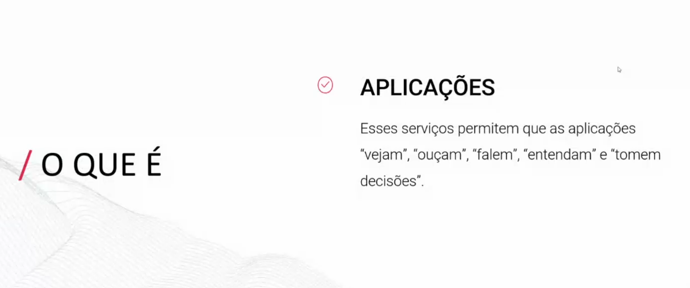

# FAS3 5 - ANÁLISE DE DOCUMENTAÇÃO COM SERVIÇOS DO AZURE - AZURE COGNITIVES SERVICES

## EXPLORAÇÃO DA PLATAFORMA E CRIAÇÃO DE UM SERVIÇO

* Portal Azure

* Criar Recurso

* Procurar "cognitive services"

* Service "Face"

* Preencher os campos

* Só clicar em "next" até criar o serviço 

* Para ver todos os serviçoes criados, ir na aba de "Menu" e clicar em "All Services"

