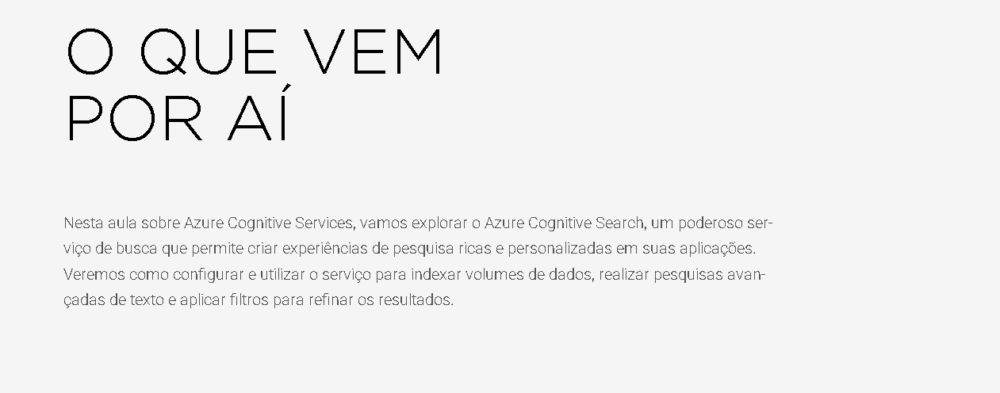
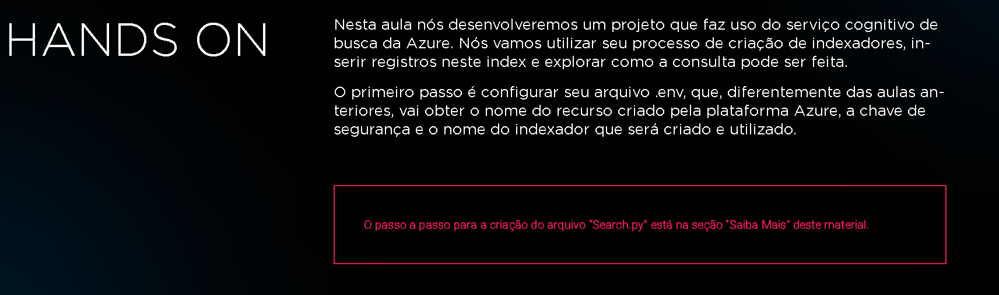

# FAS3 5 - ANÁLISE DE DOCUMENTAÇÃO COM SERVIÇOS DO AZURE - AZURE COGNITIVE SEARCH

## Material Complementar

* Azure AI Search client library: https://learn.microsoft.com/en-us/python/api/overview/azure/search-documents-readme?view=azure-python
* SearchField Class: https://learn.microsoft.com/en-us/python/api/azure-search-documents/azure.search.documents.indexes.models.searchfield?view=azure-python