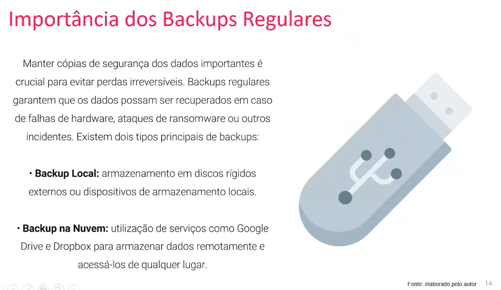
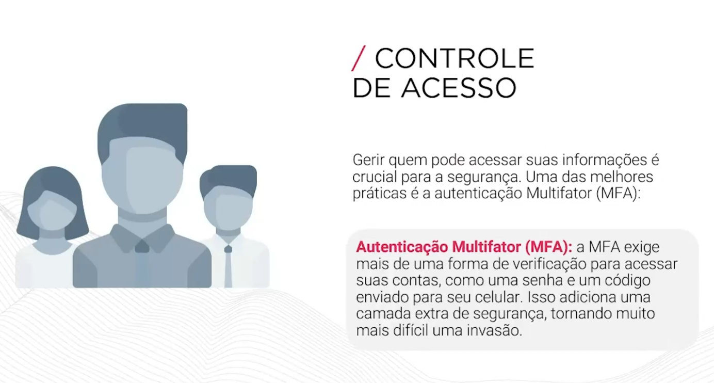

# FASE 5 - PRIVACIDADE E PROTEÇÃO DE DADOS - SEGURANÇA E PROTEÇÃO DE DADOS

## Introdução

### Importância da Segurança de Dados

Proteger os dados significa garantir a privacidade, a integridade e a disponibilidade das informações.

### Principais Ameaças à Segurança de Dados

### Malware

### Tipos de Malware

### Phishing e Ransomware

### Boas Práticas de Segurança

Implementar boas práticas de segurança é essencial para proteger os dados. Isso inclui:

* **Senhas Fortes:** Utilizar combinações complexas de caracteres para dificultar adivinhações.
* **Autenticação de Dois Fatores (2FA):** Adicionar uma camada extra de segurança além da senha.
* **Atualizações Regulares:** Manter sistemas e softwares atualizados para corrigir vulnerabilidades.

### Ferramentas de Segurança

Diversas ferramentas podem ajudar a proteger os dados:

* **Gerenciadores de Senhas:** LasPass, 1Password. Esses aplicativos ajudam a criar e armazenar senhas fortes e únicas para cada conta.
* **Aplicativos de Autenticação:** Google Authenticator, Authy. Aplicativos que geram códigos de verificação para autenticação de dois fatores, aumentando a segurança das contas.

### Importância dos Backups Regulares

### Exemplos de Seguraça em Ação

### Importância da Criptografia

### Protocolos de Segurança na Internet

### Segurança de Redes Domésticas

Proteger a rede de sua casa é essencial para evitar acessos não autorizados. Algumas práticas recomendadas incluem:

* **Uso de Senhas Fortes para Wi-Fi:** Utilize uma senha complexa e única para a sua rede Wi-Fi.
* **Mudar a Senha Padrão do Roteador:** As senhas padrão dos roteadores são fáceis de descobrir. Troque por uma senha única e complexa.
* **Ocultar o Nome da Rede (SSID):** Evita que sua rede apareça nas listas de redes disponíveis, dificultando tentativas de acesso não autorizado.

### Controle de Acesso

### Práticas de Segurança em Dispositivos

### Proteção de Dados em Aplicações

### Conformidade com Legislações de Proteção de Dados

### Educação e Consciência em Segurança Digital

### Conclusão

