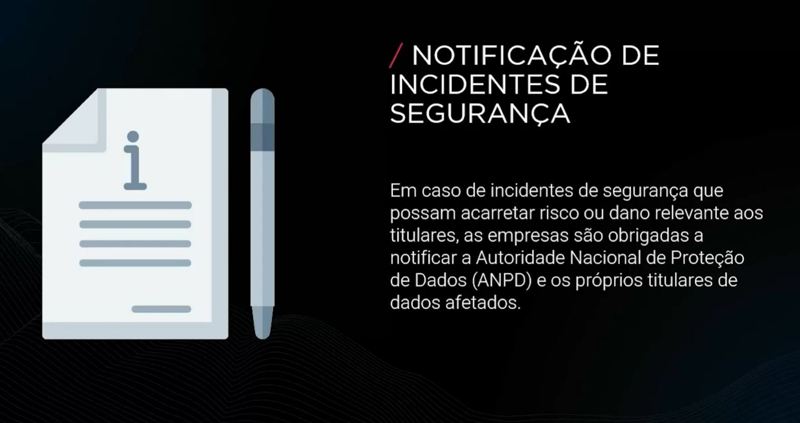
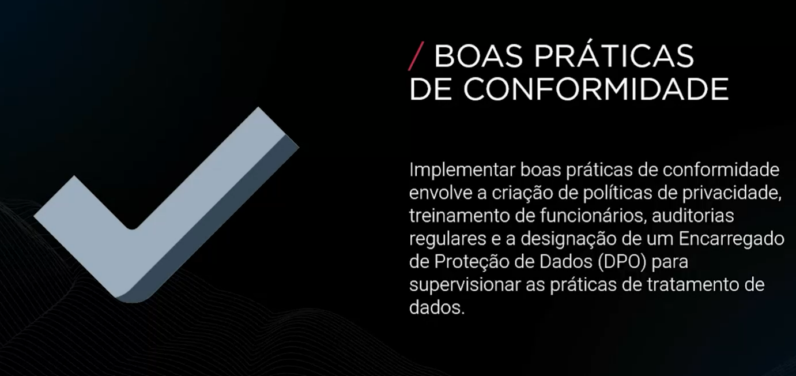

# FASE 5 - PRIVACIDADE E PROTEÇÃO DE DADOS - LEGISLAÇÃO E REGULAMENTAÇÃO DE PROTEÇÃO DE DADOS (LGPD)

## INTRODUÇÃO À LGPD

A Lei Geral de Proteção de Dados (LGPD) é um marco legal que estabelece diretrizes para a proteção de dados pessois no Brasil. Ela visa garantir a privacidade dos indivíduos, assegurando que seus dados sejam tratados de forma transparente e segura. A LGPD é inspirada em regulamentações internacionais, como o GDPR da União Europeia.

### Princípios Fundamentais da LGPD

### Direitos dos Titulares de Dados

### Obrigações das Empresas

### Penalidades do Não Cumprimento

### Consentimento e Transparência

### Medidas de Segurança

### Avaliações Impacto à Proteção de Dados

### Notificação de Incidentes de Segurança

### Boas Práticas de Confirmidade

### Exemplos Práticos de Implementação

### Comparação Entre LGPD e GDPR

### Desafios da Implementação da LGPD

### Benefícios da Conformidade com a LGPD

### Ferramentas e Tecnologias de Conformidade

### Treinamento e Conscientização

### Responsabilidades do Encarregado de Proteção de Dados (DPO)

### Futuro da Proteção de Dados no Brasil

## Conclusão

