# FASE 5 - PRIVACIDADE E PROTEÇÃO DE DADOS - REGULAMENTO GERAL DE PROTEÇÃO DE DADOS DA UNIÃO EUROPEIA (GDPR)

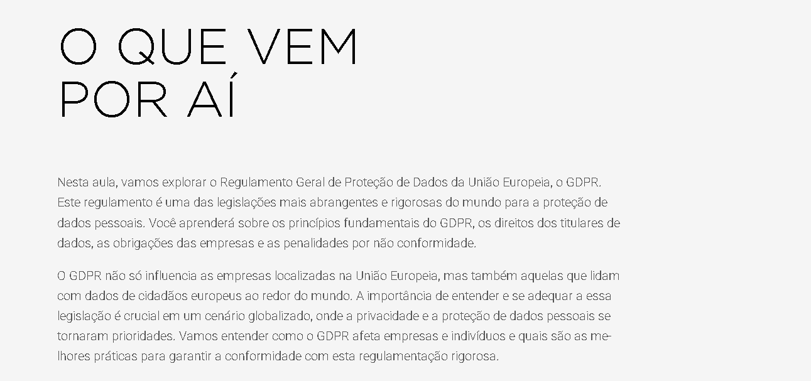

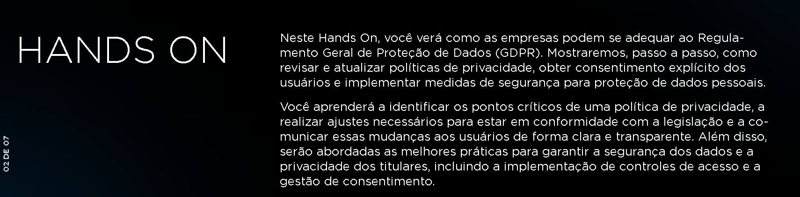

## INTRODUÇÃO AO GDPR

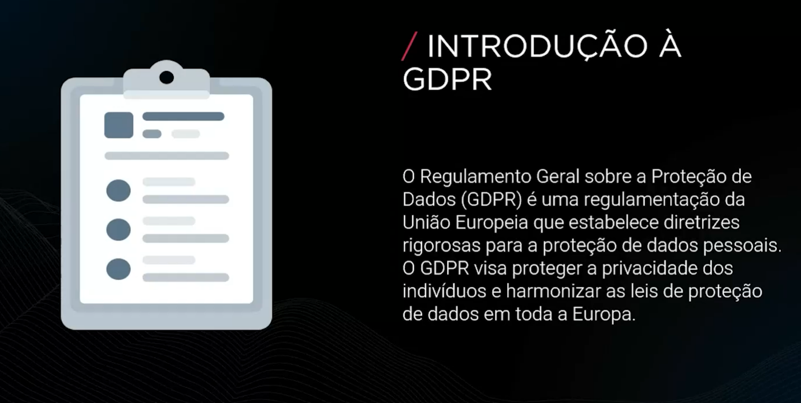

### PRINCÍPIOS FUNDAMENTAIS DA GDPR

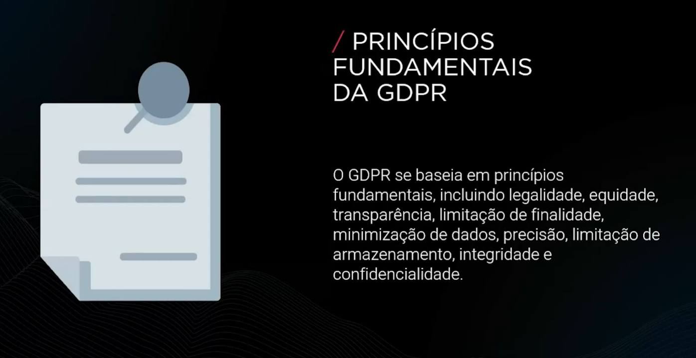

### DIREITOS DOS INDIVÍDUOS

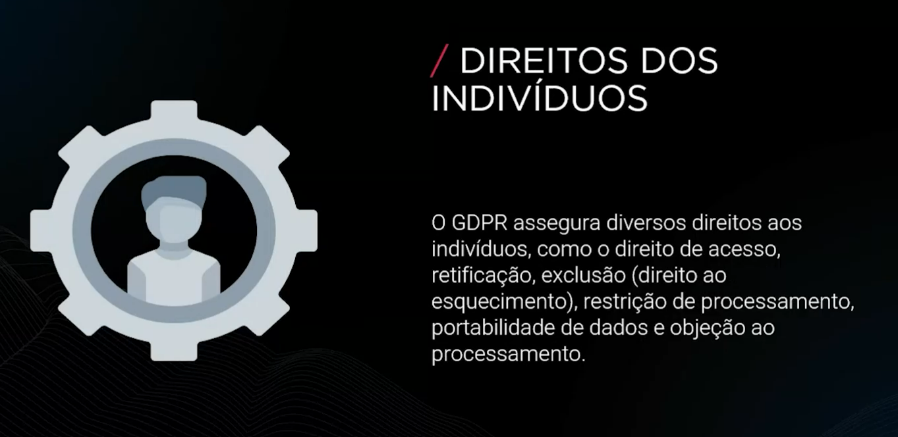

### RESPONSABILIDADES DAS ORGANIZAÇÕES

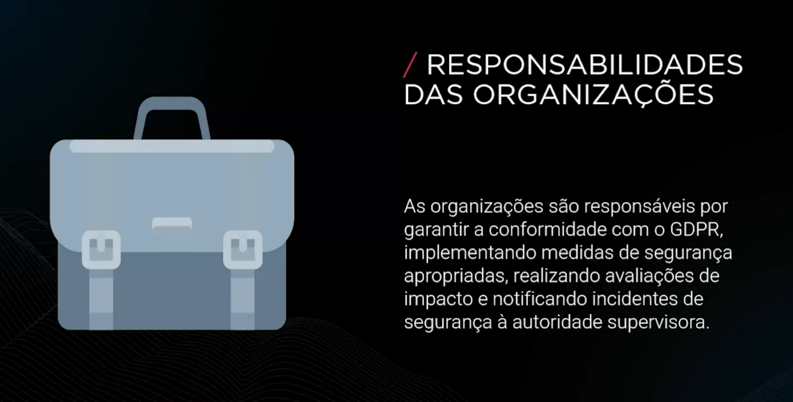

### CONSENTIMENTO E TRANSPARÊNCIA

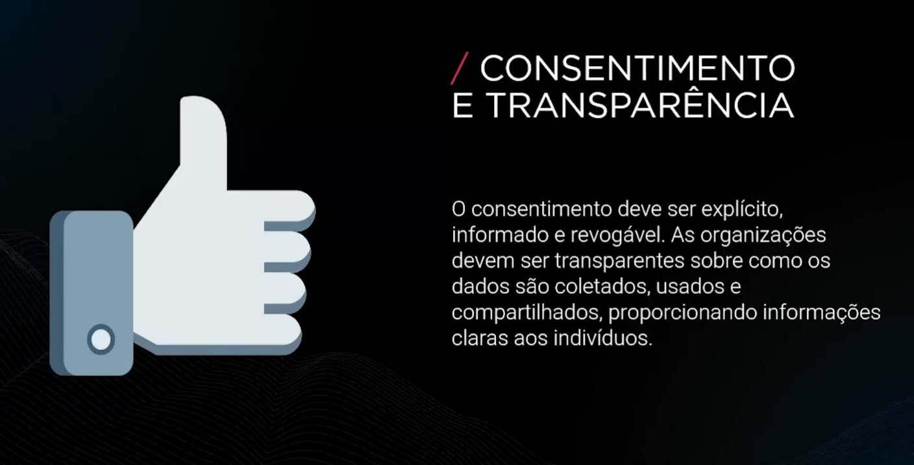

### MEDIDAS DE SEGURANÇA

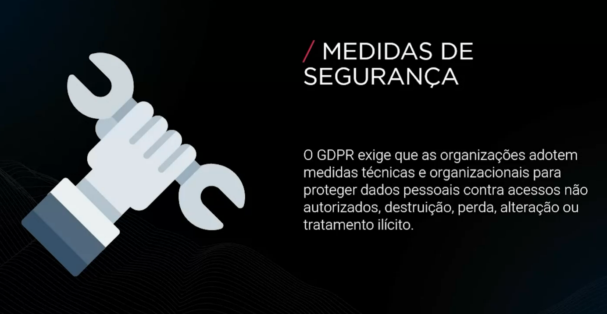

### AVALAIÇÃO DE IMPACTO À PROTEÇÃO DE DADOS (DPIA)

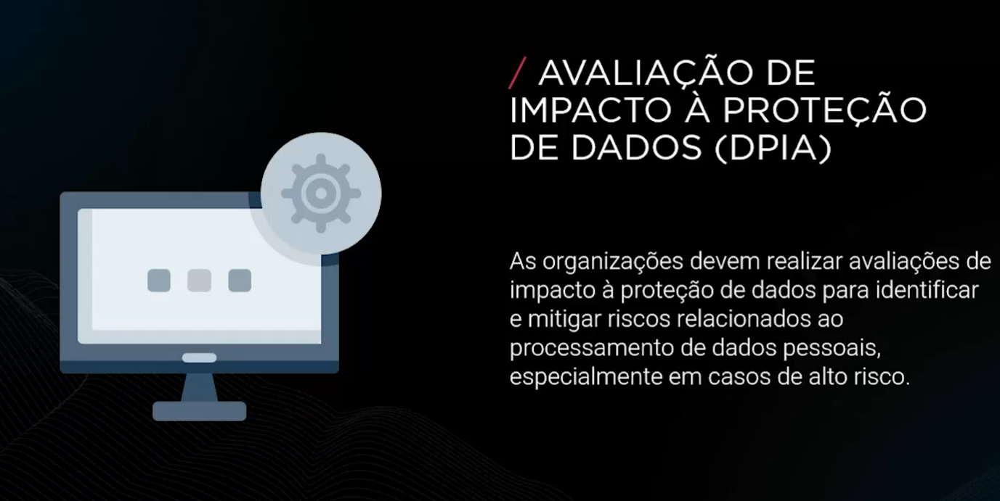

### NOTIFICAÇÃO DE INCIDENTES DE SEGURANÇA

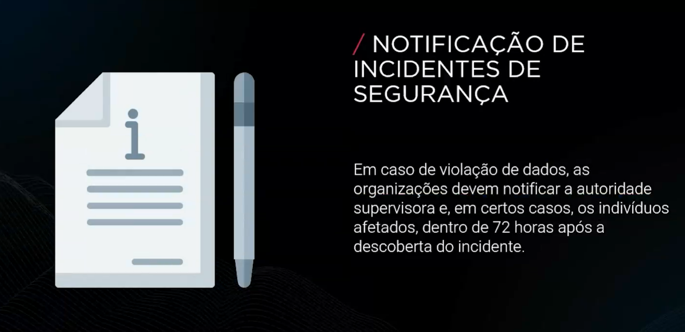

### PENALIDADES PELO NÃO CUMPRIMENTO

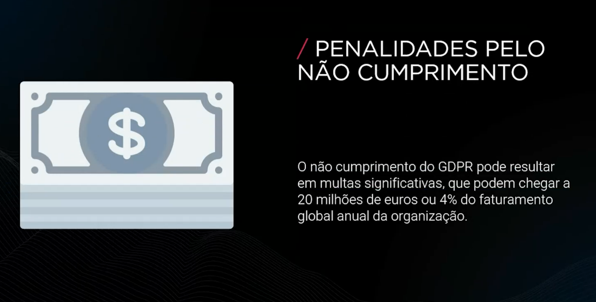

### BOAS PRÁTICAS DE CONFORMIDADE

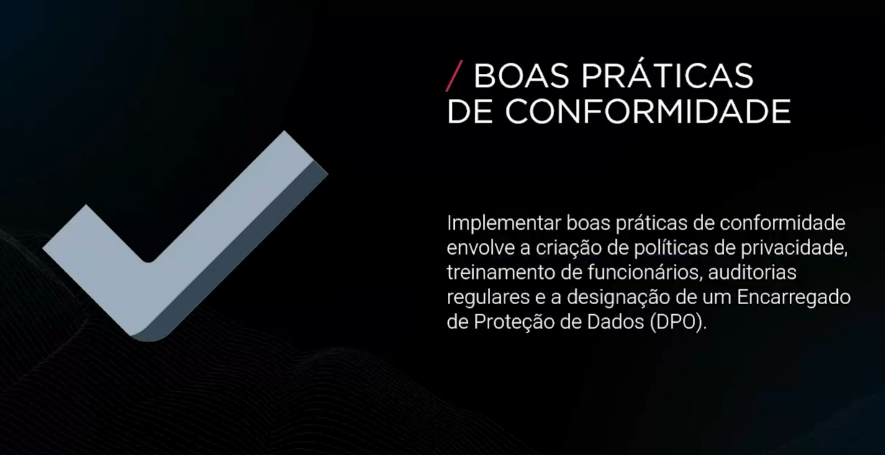

### EXEMPLOS PRÁTICOS DE IMPLEMTAÇÃO DO GDPR

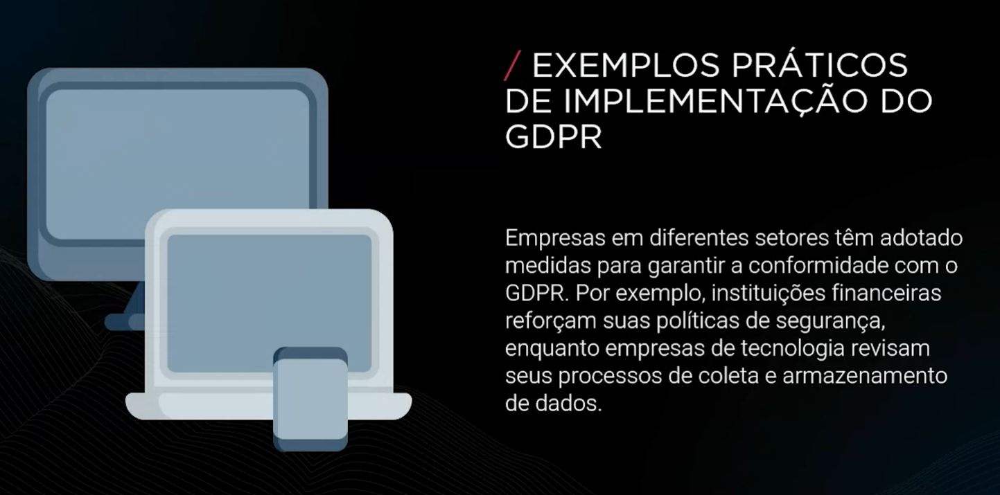

### COMPARAÇÃO ENTRE GDPR E LGPD

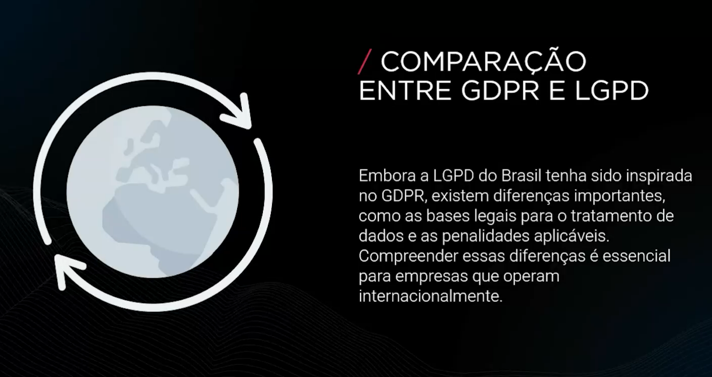

### COMPARAÇÃO ENTRE GDPR E LGPD

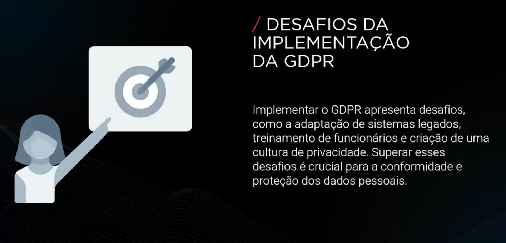

### BENEFÍCIOS DA CONFORMIDADE COM A GDPR

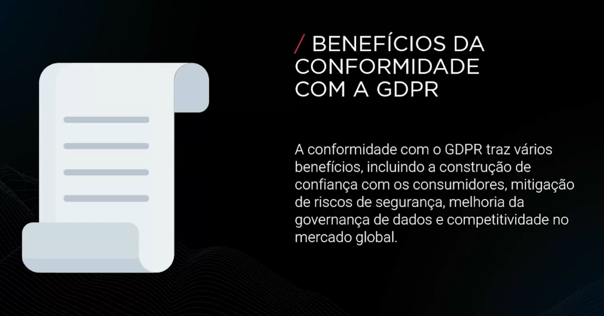

### FUTURO DA PROTEÇÃO DE DADOS NA UNIÃO EUROPEIA

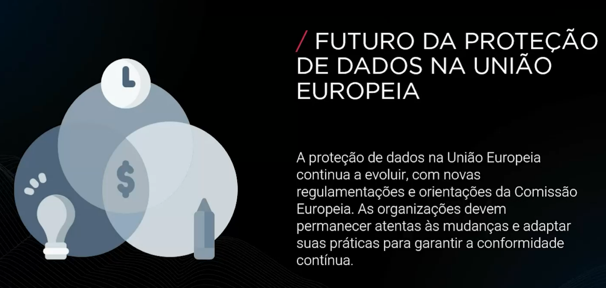

## CONCLUSÃO

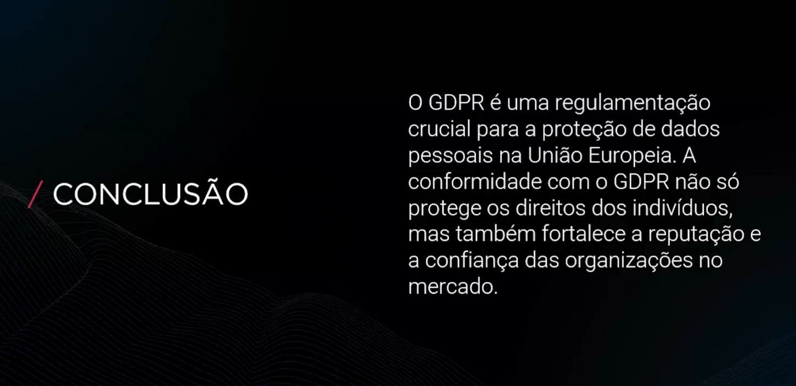
