# FASE 5 - PRIVACIDADE E PROTEÇÃO DE DADOS - PROTEÇÃO AOS DADOS NO MUNDO DA IA

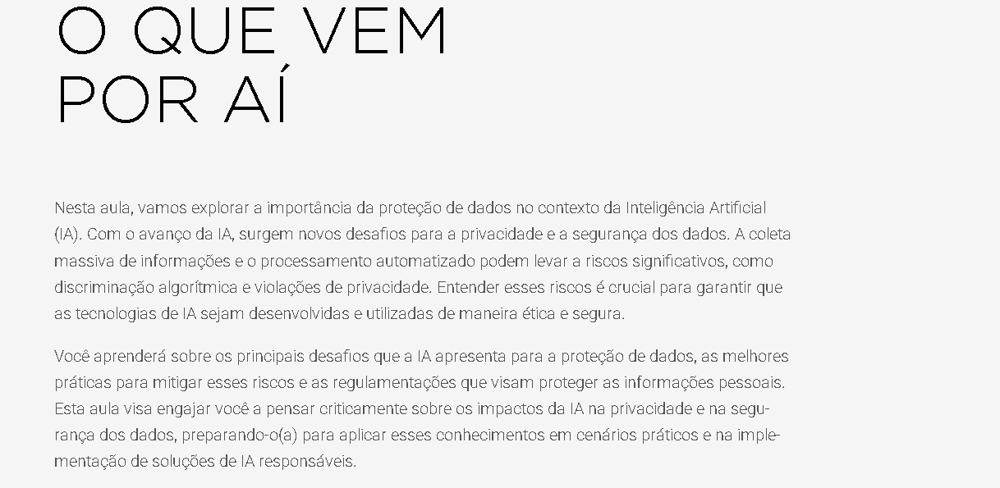

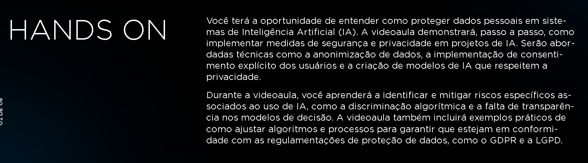

## INTRODUÇÃO À PROTEÇÃO DE DADOS NA IA

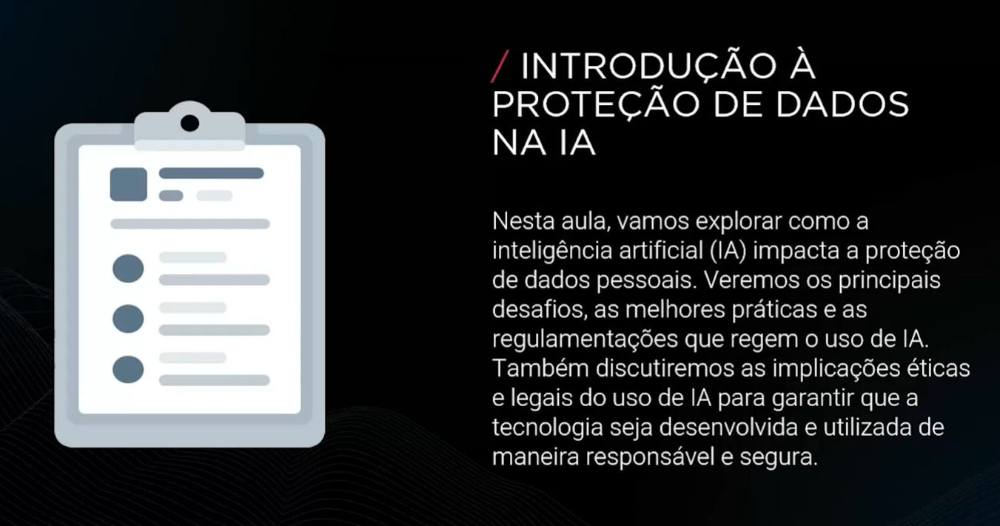

### DESAFIOS ESPECÍFICOS NA PROTEÇÃO DE DADOS EM IA

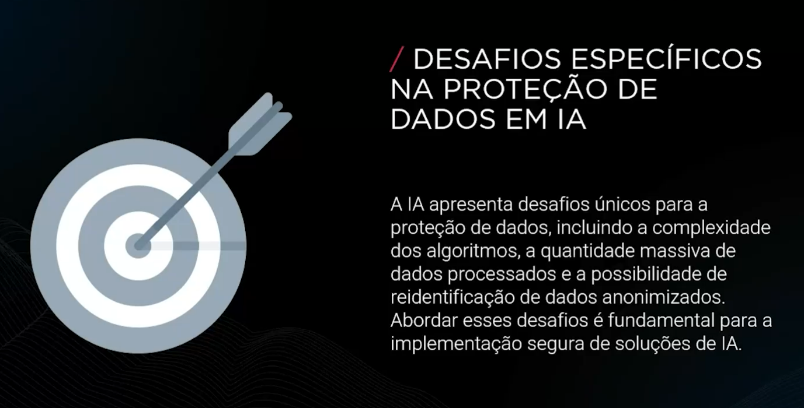

### IMPLICAÇÕES ÉTICAS DO USO DE IA

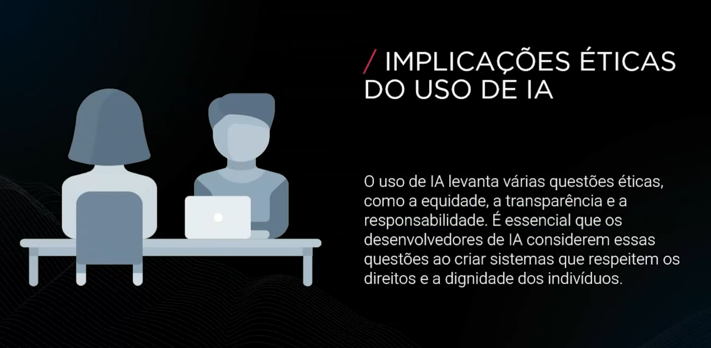

### PRINCÍPIOS ÉTICOS FUNDAMENTAIS NA IA

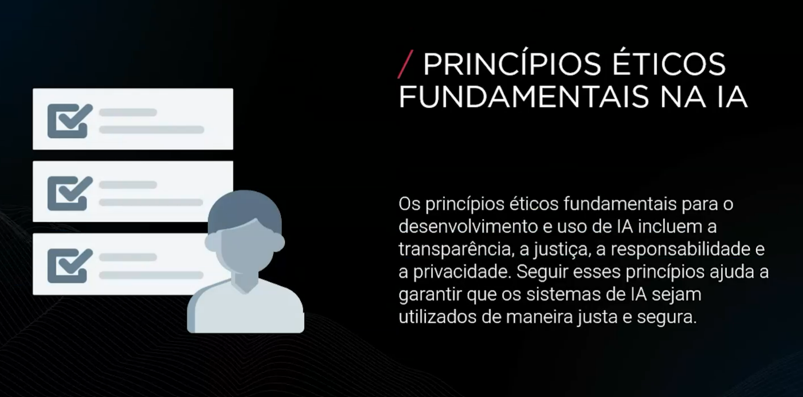

### MEDIDAS DE SEGURANÇA EM IA

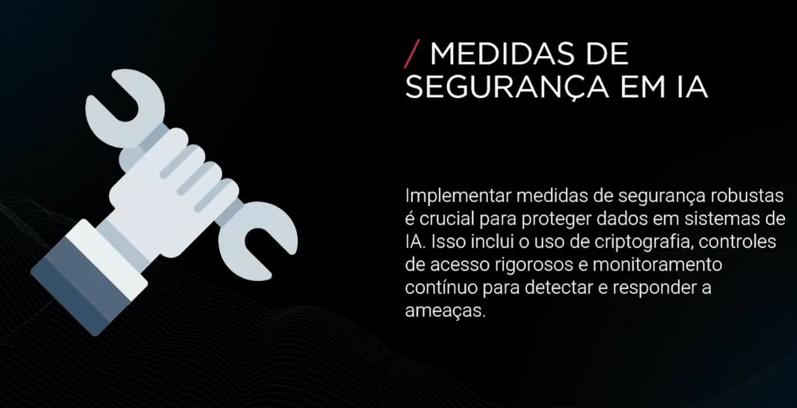

### BOAS PRÁTICAS PARA MITIGAR RISCOS NA IA

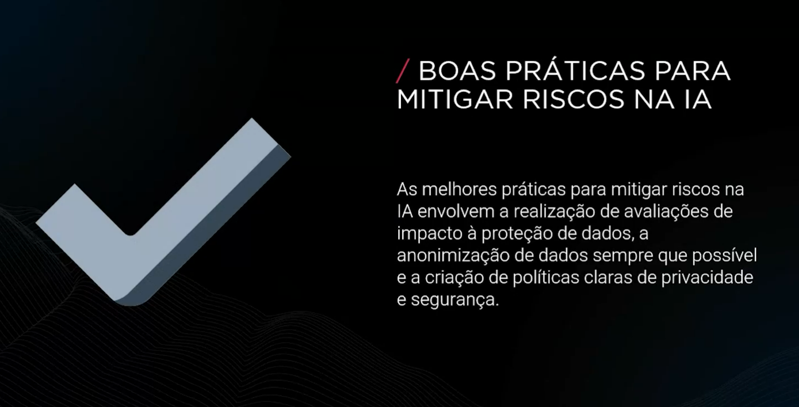

### EXEMPLOS PRÁTICOS DE PROTEÇÃO DE DADOS EM IA

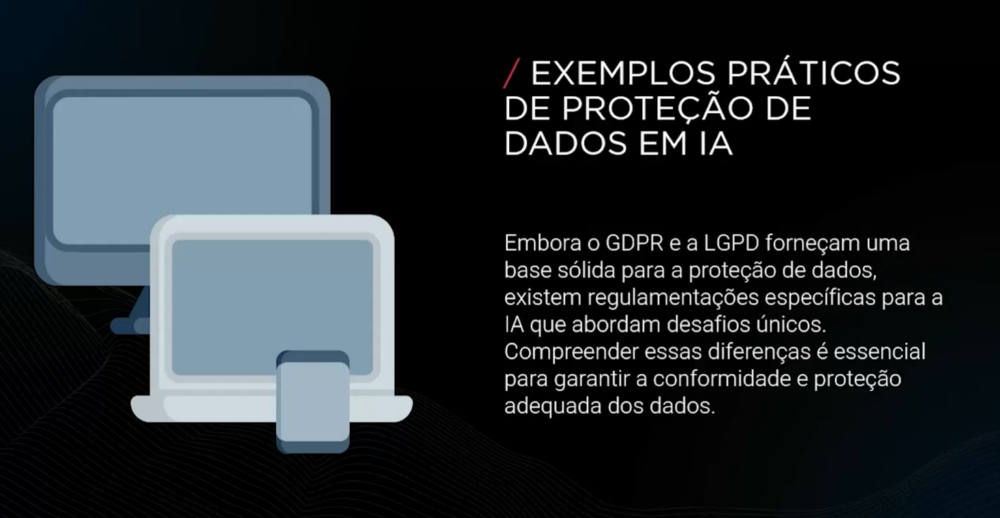

### COMPARAÇÃO ENTRE GDPR, LGPD E REGULAMENTAÇÕES DE IA

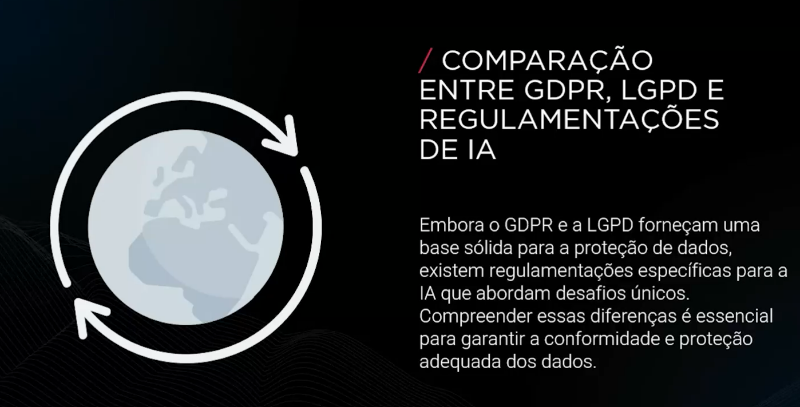

### IMPACTO DE IA NA PRIVACIDADE

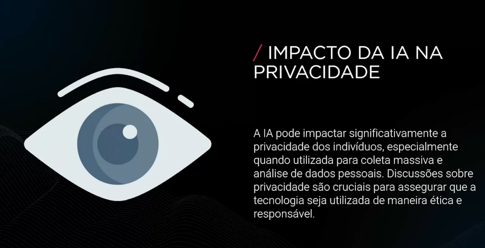

### DESAFIOS ÉTICOS NO DESENVOLVIMENTO DE IA

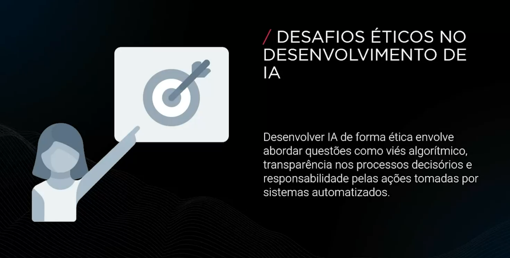

### IMPORTÂNCIA DA TRANSPARÊNCIA NA IA

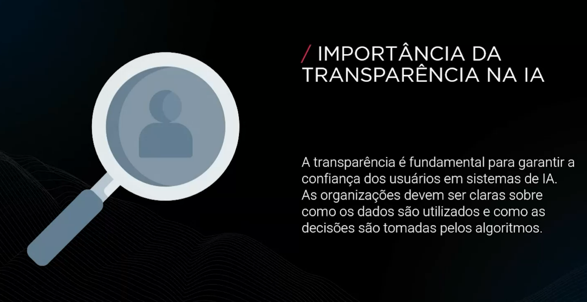

### RESPONSABILIDADE NO USO DE IA

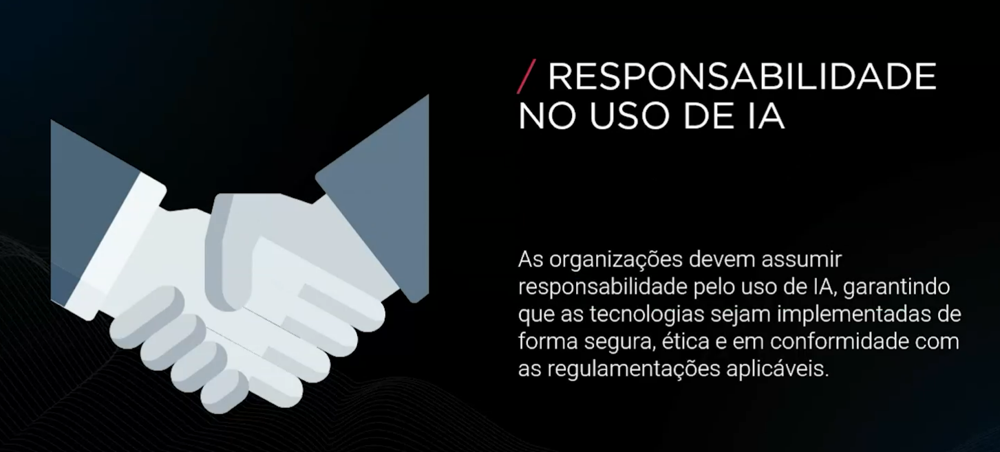

### TECNOLOGIAS PARA PROTEÇÃO DE DADOS EM IA

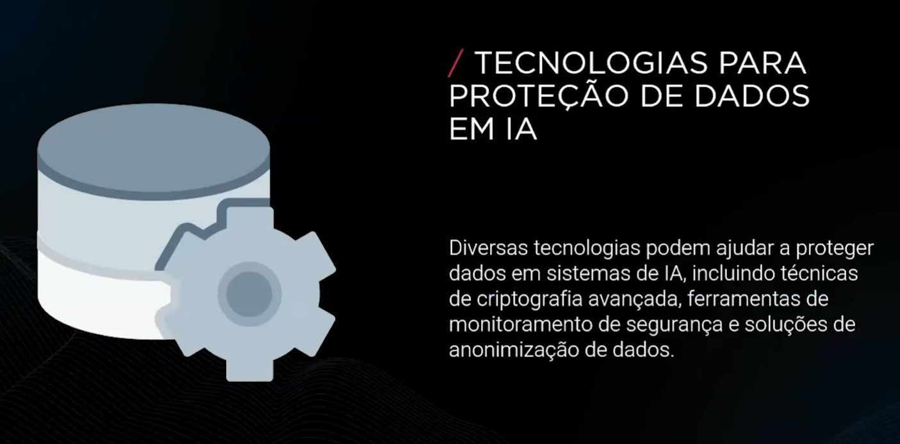

### BOAS PRÁTICAS DE IMPLEMENTAÇÃO DE IA

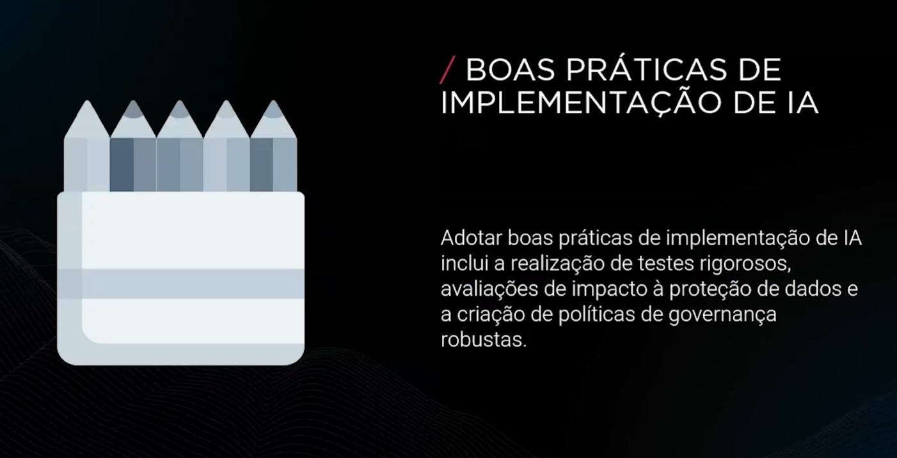

### FUTURO DA PROTEÇÃO DE DADOS NA IA

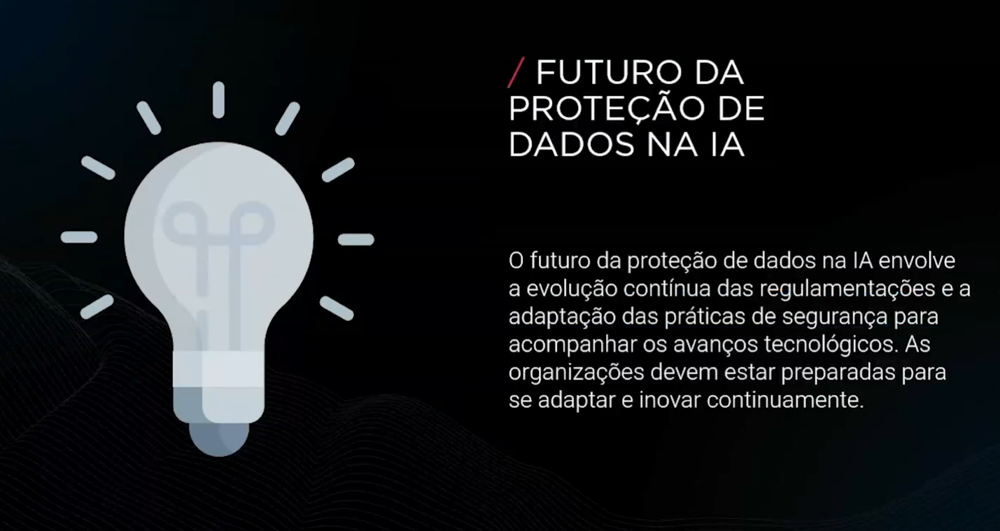

### CONCLUSÃO

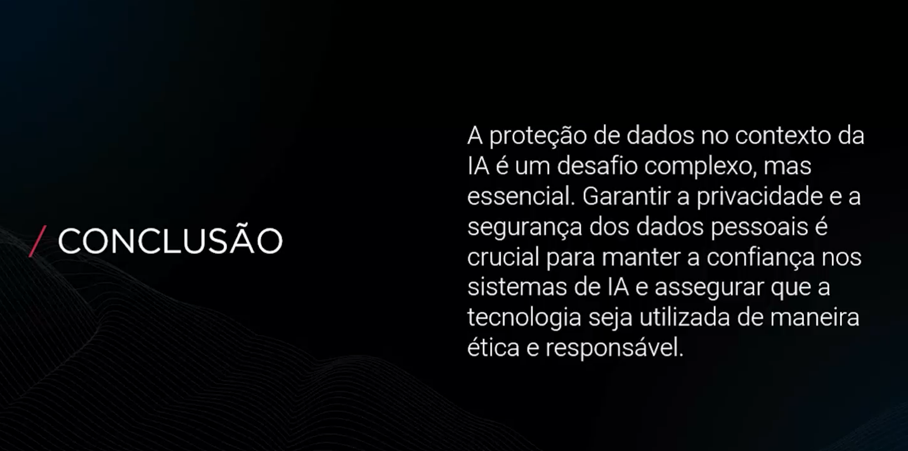
